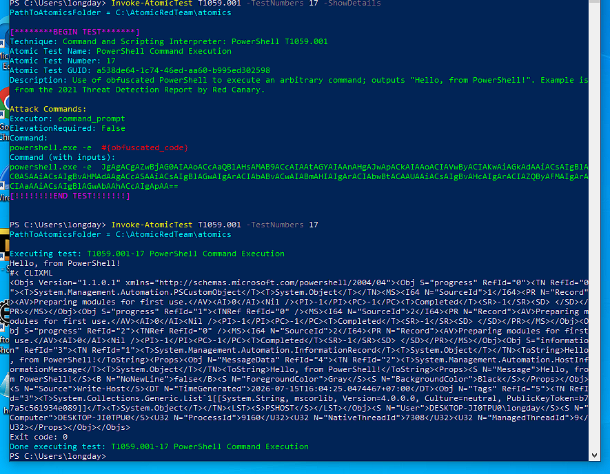
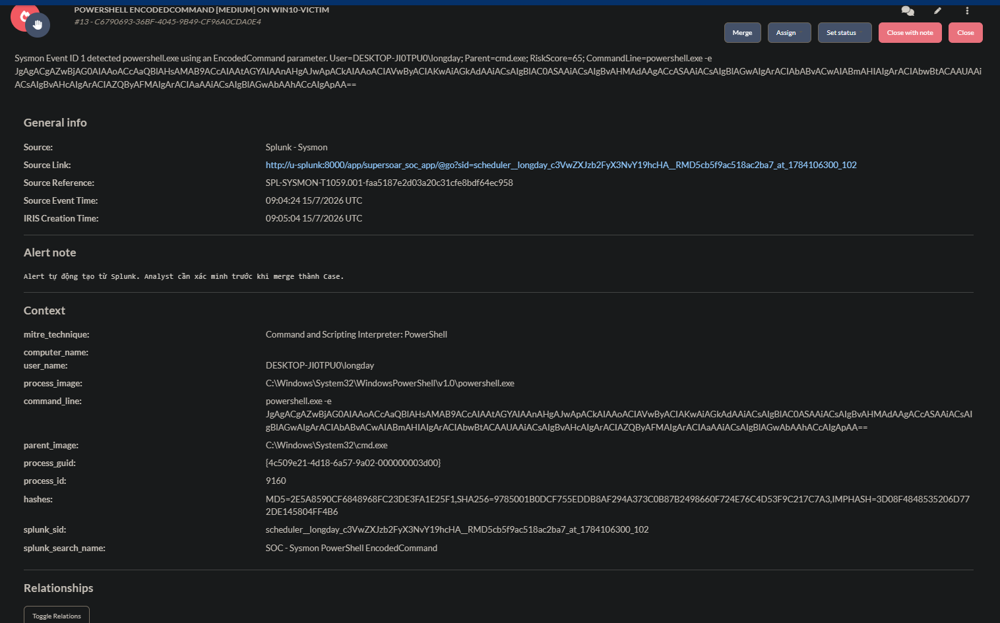
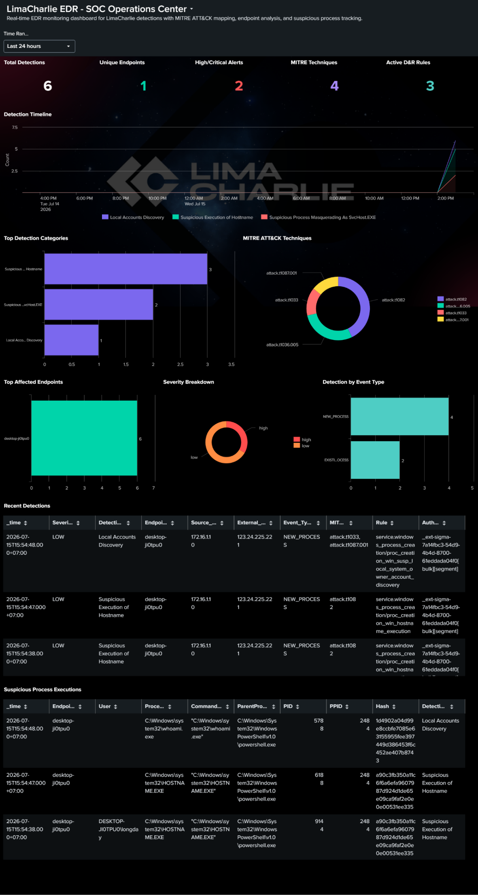
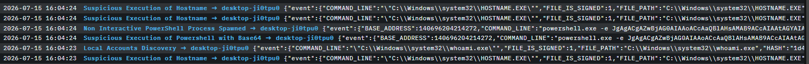
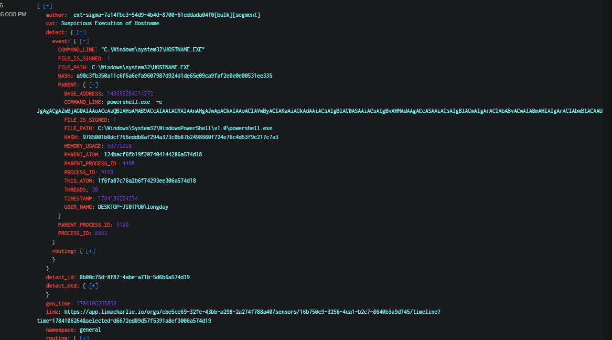
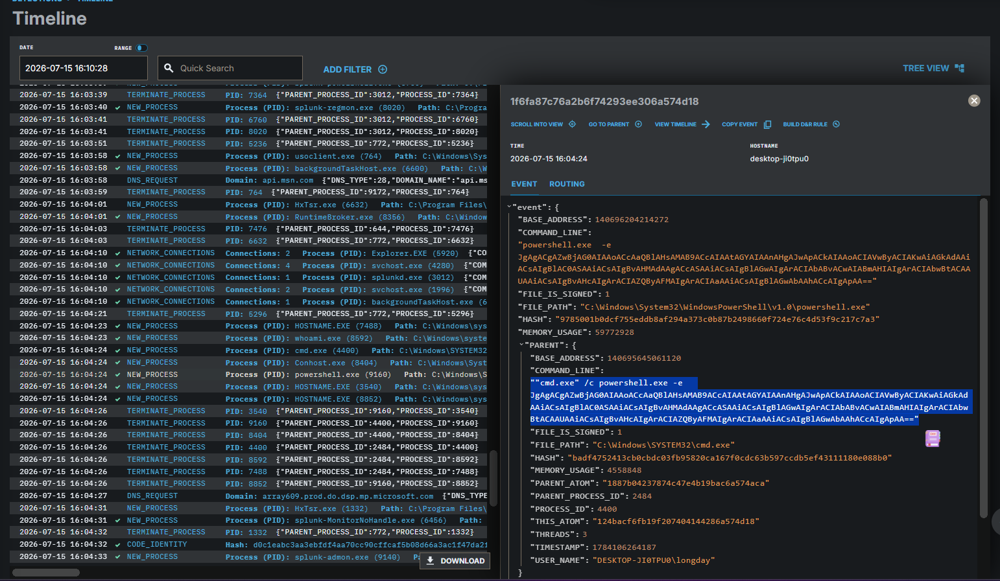
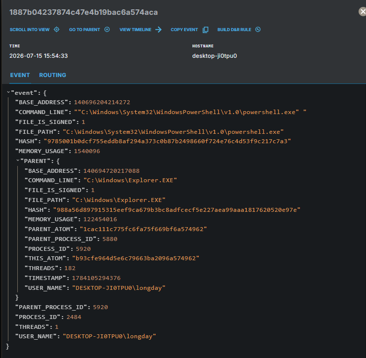
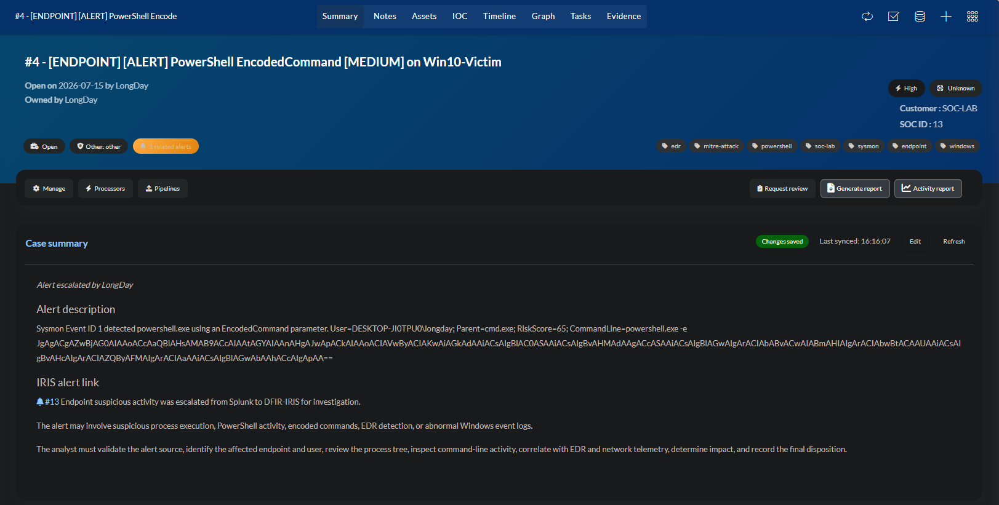
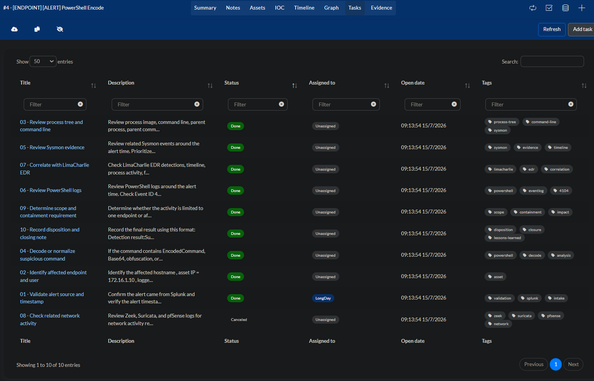

**T1059.001 ****Test**** 17 - ****PowerShell**** ****EncodedCommand**** ****Execution**
1. Executive Summary
- Vào thời điểm kiểm thử, endpoint DESKTOP-JI0TPU0 / 172.16.1.10 đã thực hiện bài test Atomic Red Team T1059.001 Test #17 - PowerShell Command Execution. Bài test mô phỏng hành vi PowerShell thực thi command bằng tham số -e, là dạng rút gọn của -EncodedCommand.
- Sysmon ghi nhận tiến trình powershell.exe được tạo với command line chứa chuỗi Base64 encoded command. Alert SOC - Sysmon PowerShell EncodedCommand được kích hoạt và đẩy sang DFIR-IRIS để phục vụ quy trình điều tra.

- Kết luận: Đây là True Positive - Authorized Simulation. Không ghi nhận bằng chứng về payload độc hại, persistence, lateral movement hoặc exfiltration. Nếu xuất hiện trong môi trường thật mà không có phê duyệt kiểm thử, hành vi này cần được xử lý ở mức Medium/High tùy parent process, user context và hoạt động mạng đi kèm.

2. Scope
Endpoint: DESKTOP-JI0TPU0
Asset name: Win10-Victim
IP: 172.16.1.10
User: DESKTOP-JI0TPU0\longday
- Data sources:
- Splunk index=win10sysmon
- Splunk index=edr
- LimaCharlie EDR console
- DFIR-IRIS Case Manager
Test framework: Atomic Red Team
Atomic test: T1059.001 Test #17 - PowerShell Command Execution
Primary detection: SOC - Sysmon PowerShell EncodedCommand

3. Alert / Detection Overview
Alert được tạo khi Splunk phát hiện Sysmon Event ID 1 - Process Creation với tiến trình powershell.exe hoặc pwsh.exe có command line chứa tham số EncodedCommand.
4. Investigation Steps
Validate alert source

**Verify**** ****process**** ****execution**** in ****Splunk**

Double check bên limacharlie thì tháy các alert liên quan tới dùng host atomic chạy powershell thực hiện bài test và thực hiện lệnh encode trên flag-e 

Sau đó alert đẩy sang case Manager DFIR-IRIS rồi sau đó tôi tiến hành xem xét alet này có thể merge thành case và có nguy hiểm không
**Analyze**** ****command**** ****line**
Check lại nguồn log trên splunk từ các index=edr win10sysmon để xác minh lệnh và thời gian ảnh hưởng

**Cross-check**** ****LimaCharlie**** EDR**

**Check**** ****network**** ****activity**
Với Atomic Test #17, payload chỉ in ra chuỗi test, thường không cần network connection.

**Determine**** ****impact**
Đánh giá tác động:
- Không ghi nhận persistence.
- Không ghi nhận credential dumping.
- Không ghi nhận lateral movement.
- Không ghi nhận file encryption.
- Không ghi nhận exfiltration.
- Không ghi nhận network connection đáng ngờ.
**Record**** ****evidence**** ****and**** ****close**** ****case**
Case closed after validation. Activity confirmed as Atomic Red Team authorized simulation. No malicious impact observed.

**MITRE ATT&CK ****Mapping**
| Technique ID | Technique Name | Evidence |
| --- | --- | --- |
| T1059.001 | PowerShell | powershell.exe executed with -e / EncodedCommand |

**Verdict**
Verdict: True Positive - Authorized Simulation
Confidence: High
Severity: Medium
Impact: None
Containment: Not required
Escalation: Not required
Case status: Closed after validation
