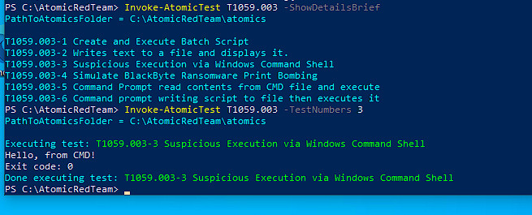
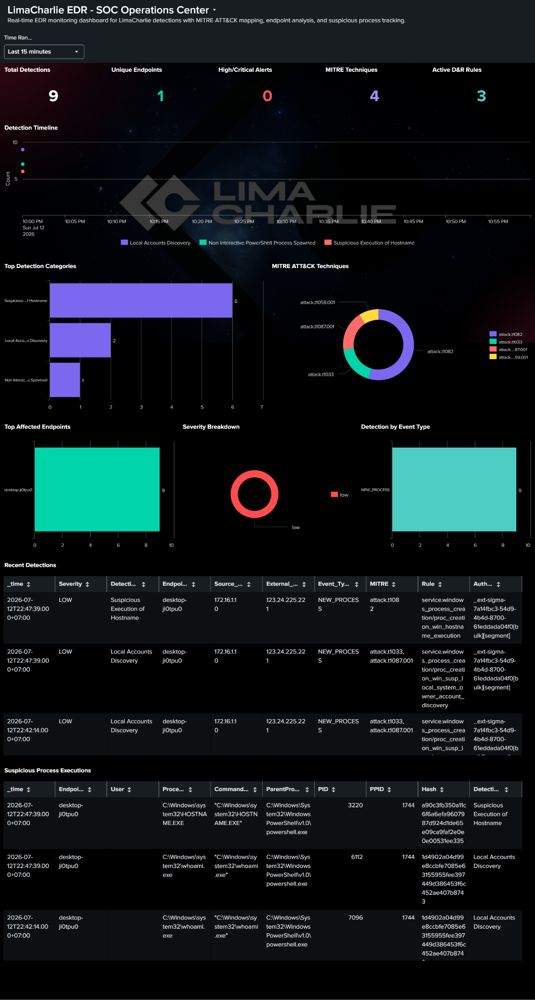
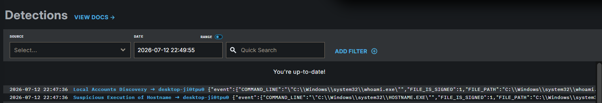
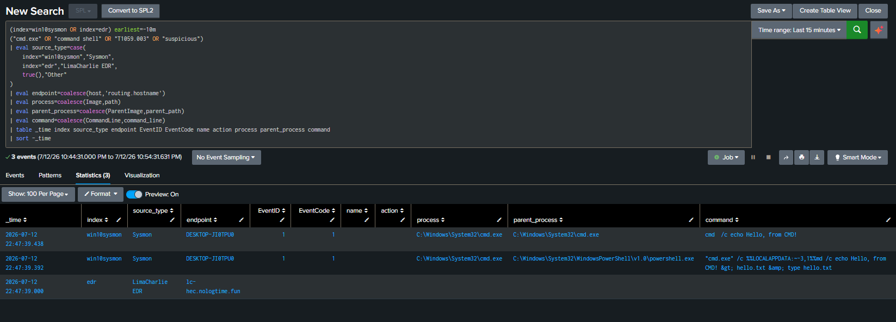

**T1059.****003****-****3**** ****Suspicious Execution via Windows Command Shell**
**1.Executive Summary**
Vào 2026-07-12 22:47:39.000, trên máy Windows 10 victim DESKTOP-JI0TPU0 đã thực hiện một bài kiểm thử Atomic Red Team mô phỏng hành vi Suspicious Execution via Windows Command Shell.
Chuỗi hành vi bắt đầu từ PowerShell chạy Invoke-AtomicTest, sau đó gọi cmd.exe để thực thi command shell đáng chú ý. Bằng chứng Sysmon cho thấy cmd.exe được chạy với command echo Hello, from CMD! trong quá trình test.
LimaCharlie EDR ghi nhận các cảnh báo liên quan đến hành vi command shell/discovery như Suspicious Execution of Hostname, Local Accounts Discovery và Non Interactive PowerShell Process Spawned. Sysmon ghi nhận chủ yếu Event ID 1 - Process Create cho cmd.exe.
Kết luận: Đây là True Positive - Authorized Simulation. Nếu xảy ra trong môi trường thật, sự kiện này nên được phân loại Medium vì thể hiện hành vi command shell đáng nghi kết hợp discovery.
Chạy test Atomic test trên máy Endpoint win10

Dashboard bắn ra các cảnh báo bất thường và tiến hành kiểm tra tương quan giữa nguồn Sysmon trong index=win10sysmon và nguồn LimaCharlie EDR 

Kiểm tra timeline cho thấy chuỗi tiến trình chính:
Chuỗi chính của test: PowerShell chạy Invoke-AtomicTest -> cmd.exe được tạo -> cmd.exe thực thi lệnh trong Windows Command Shell.
Nhưng EDR luôn đi trước các hành động của lệnh test và gửi log kịp thòi lên splunk

**2.Scope**
- Endpoint: DESKTOP-JI0TPU0
- IP: 172.16.1.10
- Time window: 2026-07-12 22:40 đến 22:55
- Data sources:
+ Sysmon logs in Splunk index=win10sysmon
+ LimaCharlie EDR logs in Splunk index=edr
+ LimaCharlie web console detections
- Test framework: Atomic Red Team
- Technique simulated: T1059.003
**3. Alert / Detection Overview**
Source: - LimaCharlie EDR

**4. Timeline**
Timeline tóm tắt: PowerShell chạy Atomic Red Team -> cmd.exe được tạo -> cmd.exe thực thi command shell -> Sysmon ghi Event ID 1 -> LimaCharlie tạo cảnh báo command execution/discovery.
Ý nghĩa điều tra: test này xác nhận lab nhìn thấy được Windows Command Shell execution, đồng thời EDR có phản ứng với các hành vi command/discovery bất thường trong cùng timeline.

**5****. Command Line Analysis**
Observed command shell pattern: cmd.exe /c echo Hello, from CMD!
PowerShell trong case này đóng vai trò chạy Invoke-AtomicTest. Kỹ thuật được mô phỏng chính là Windows Command Shell thông qua cmd.exe.
cmd.exe thực thi command shell trong môi trường lab. Các cảnh báo EDR bổ sung cho thấy có thêm tín hiệu discovery như whoami.exe và hostname.exe trong cùng khung thời gian.

**6****. Network Evidence**
Network Evidence / Local Execution Evidence:
- Test T1059.003-3 tập trung vào command execution và discovery cục bộ, không phải download payload từ Internet.
- Bằng chứng chính là Sysmon Event ID 1 cho cmd.exe, hostname.exe

**7****. EDR Detection Analysis**
LimaCharlie EDR ghi nhận đúng hành vi mô phỏng trong bài test: command shell/discovery activity trên endpoint DESKTOP-JI0TPU0. Đây là kết quả True Positive - Authorized Simulation với độ tin cậy khá cao. Tuy nhiên, mức độ nghiêm trọng của riêng test này nên đánh giá Medium vì chưa có bằng chứng credential dumping, download payload hoặc ransomware impact.
**8****. MITRE ATT&CK Mapping**
Hoạt động được quan sát tương ứng với MITRE ATT&CK T1059.003 do cmd.exe được sử dụng để thực thi lệnh qua Windows Command Shell. Các tín hiệu whoami.exe và hostname.exe trong cùng timeline hỗ trợ thêm cho discovery T1033 và T1082. Không mapping case này sang T1105 hoặc T1003 vì không có download payload hoặc credential dumping.
| Technique | Name | Evidence |
| --- | --- | --- |
| T1059.003 | Windows Command Shell | cmd.exe được thực thi trong Atomic test với command shell activity |
| T1059 | Command and Scripting Interpreter | PowerShell chạy Invoke-AtomicTest và kích hoạt cmd.exe trong môi trường lab |

**9****. Verdict**
- True Positive - Authorized Simulation
- Confidence: High
- Severity: Medium
