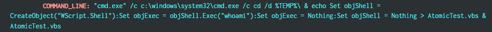
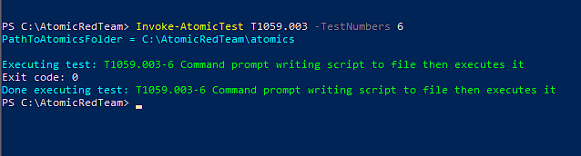
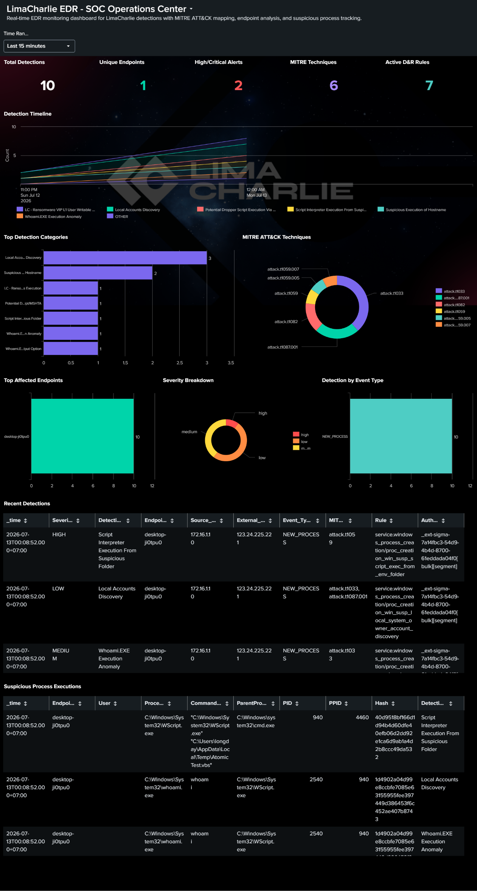
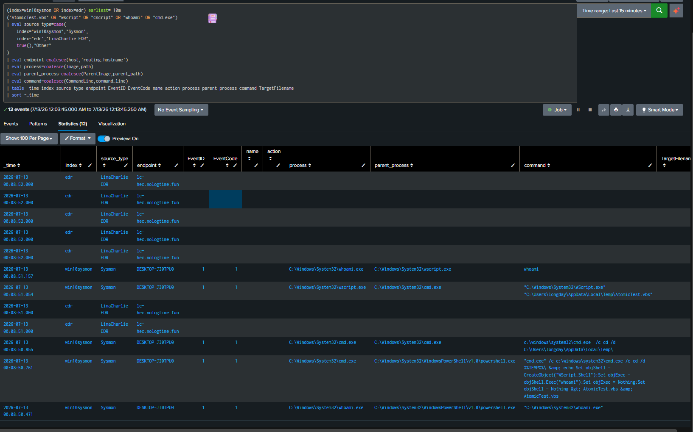
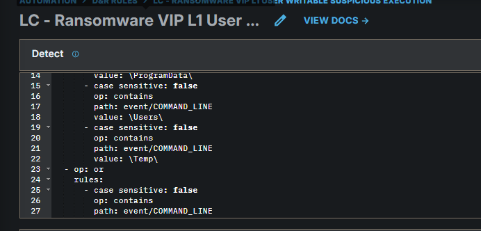
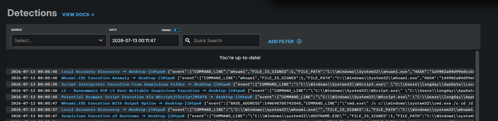

**T1059.****003****-****6**** ****Command**** ****prompt**** ****writing**** ****script**** to ****file**** then ****executes**** ****it**
**1.Executive ****Summary**
Chuỗi hành vi bắt đầu từ PowerShell chạy Invoke-AtomicTest, sau đó gọi cmd.exe để thực thi command shell đáng chú ý. Bằng chứng Sysmon cho thấy cmd.exe được chạy sau đó di chuyển vào thư mục %Temp% sau đó ghi nội dung VBScript ra file AtomicTest.vbs sau đó thực thi file vừa tạo rồi tạo COM object để thực thi lệnh hệ thống chạy lệnh whoami.exe .

Sysmon ghi nhận các tiến trình liên quan gồm cmd.exe, wscript.exe và whoami.exe thông qua Event ID 1 - Process Creation. LimaCharlie EDR cũng tạo nhiều cảnh báo liên quan đến script execution, suspicious command shell và execution từ thư mục user-writable.
Kết luận: Đây là True Positive - Authorized Simulation. Trong môi trường thật, hành vi command shell ghi script vào thư mục Temp rồi thực thi cần được điều tra vì đây là pattern phổ biến trong malware loader, dropper hoặc second-stage execution.
Chạy test Atomic test trên máy Endpoint win10

Dashboard bắn ra các cảnh báo bất thường và tiến hành kiểm tra tương quan giữa nguồn Sysmon trong index=win10sysmon và nguồn LimaCharlie EDR

Kiểm tra timeline cho thấy chuỗi tiến trình chính:
Chuỗi chính của test: PowerShell chạy Invoke-AtomicTest -> cmd.exe được tạo -> cmd.exe thực thi lệnh tạo file AtomicTest.vbs được ghi xuống thư mục Temp (đây là thư mục user có quyền ghi)-> wscript.exe thực thi AtomicTest.vbs -> whoami.exe được gọi để xác định user hiện tại
Nhưng EDR luôn đi trước các hành động của lệnh test và gửi log kịp thòi lên splunk

**2.Scope**
- Endpoint: DESKTOP-JI0TPU0
- User: longday
- IP: 172.16.1.10
- Time window: 2026-07-13 00:08:47 đến 00:08:52
- Test framework: Atomic Red Team
- Technique simulated: T1059.003 - Windows Command Shell
- Atomic Test Number: 6
Atomic Test Name: Command prompt writing script to file then executes it
**3. ****Alert**** / ****Detection**** ****Overview**
Source: - LimaCharlie EDR
Rule LC - Ransomware VIP L1 User Writable Suspicious Execution match vì tiến trình này chạy trong thư mục %Temp%
Còn các Rule còn lại match rất nhiều vì Lệnh test thực thi lệnh whoami bằng cmd

**4. ****Timeline**
Chuỗi tiến trình cho thấy Windows Command Shell được dùng để tạo và thực thi VBScript. Sau đó VBScript gọi whoami.exe để lấy thông tin user hiện tại. Đây là hành vi phù hợp với mô phỏng malware second-stage execution.

**5****. ****Command**** ****Line**** ****Analysis**
"cmd.exe" /c c:\windows\system32\cmd.exe /c cd /d %TEMP%\ &amp
; echo Set objShell = CreateObject("WScript.Shell")
:Set objExec = objShell.Exec("whoami")
:Set objExec = Nothing              Dọn object sau khi thực thi
:Set objShell = Nothing &gt        Dọn COM object
; AtomicTest.vbs &amp; AtomicTest.vbs

**6****. ****Network**** ****Evidence**
Network Evidence / Local Execution Evidence:
- Test T1059.003-6 tập trung vào command execution và discovery cục bộ, không phải download payload từ Internet.

**7****. EDR ****Detection**** ****Analysis**
LimaCharlie EDR phát hiện nhiều cảnh báo liên quan cùng một chuỗi hành vi.
Các detection đáng chú ý:
- LC - Ransomware VIP L1 User Writable Suspicious Execution
- Script Interpreter Execution From Suspicious Folder
- Potential Dropper Script Execution Via WScript/CScript/MSHTA
- Whoami.EXE Execution Anomaly
- Local Accounts Discovery
**8****. MITRE ATT&CK ****Mapping**
Hoạt động được quan sát tương ứng với MITRE ATT&CK T1059.003 do cmd.exe được sử dụng để thực thi lệnh qua Windows Command Shell. Các tín hiệu whoami.exe và hostname.exe trong cùng timeline hỗ trợ thêm cho discovery T1033 và T1082. Không mapping case này sang T1105 hoặc T1003 vì không có download payload hoặc credential dumping.
| Technique | Name | Evidence |
| --- | --- | --- |
| T1059.003 | Windows Command Shell | cmd.exe /c được dùng để ghi và thực thi script |
| T1059.005 | Visual Basic | AtomicTest.vbs được tạo và chạy qua wscript.exe |
| T1033 | System Owner/User Discovery | VBScript gọi whoami.exe |

**9****. ****Verdict**
Hành vi quan sát được khớp với Atomic Red Team test T1059.003-6. Sysmon ghi nhận cmd.exe, wscript.exe và whoami.exe. LimaCharlie EDR tạo nhiều detection liên quan đến script interpreter execution, user-writable suspicious execution và local account discovery. Payload trong bài test là benign vì chỉ chạy whoami, nhưng behavior pattern có giá trị cao để kiểm tra detection.
- Verdict: True Positive - Authorized Simulation
- Confidence: High
- Severity: Medium
