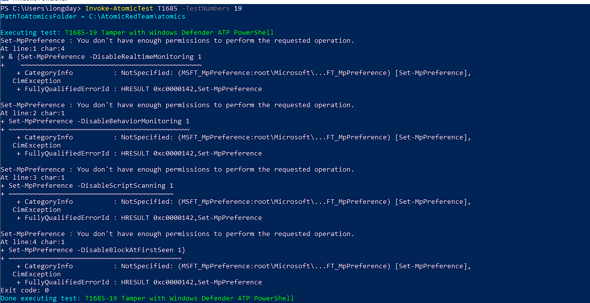
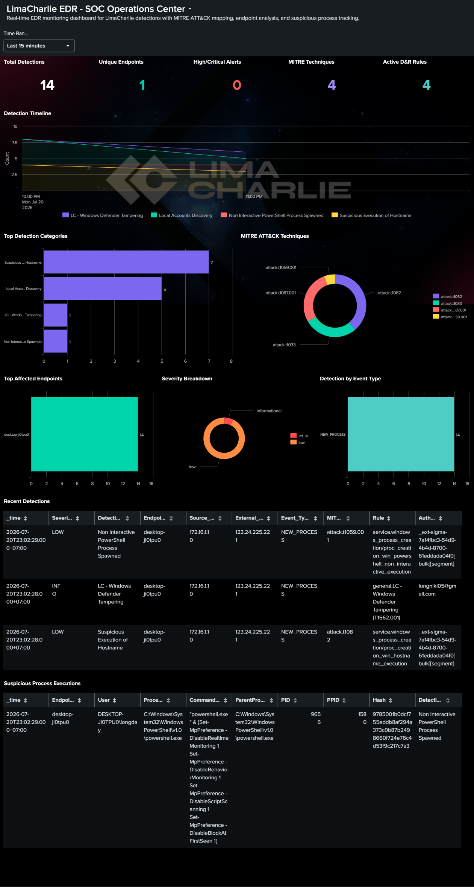
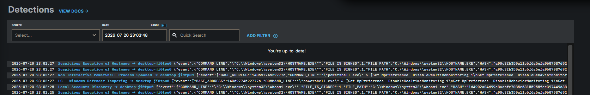
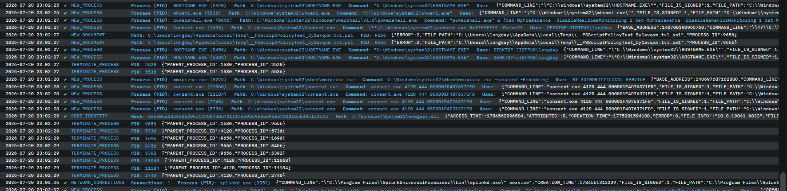
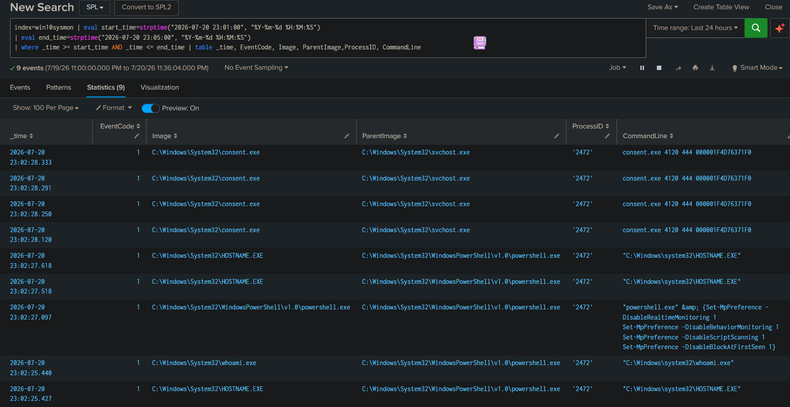
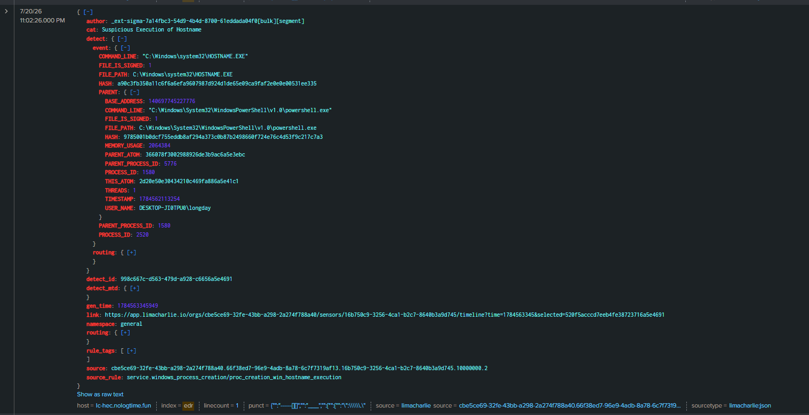
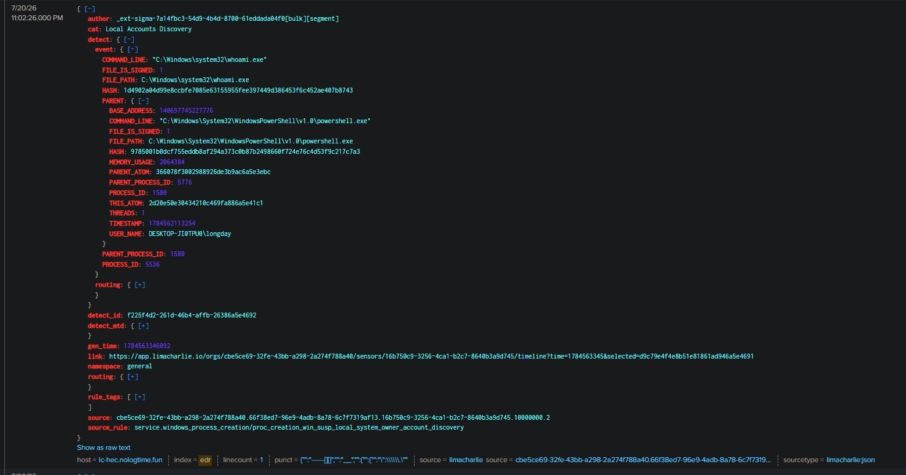
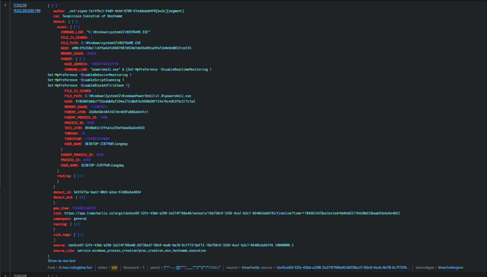
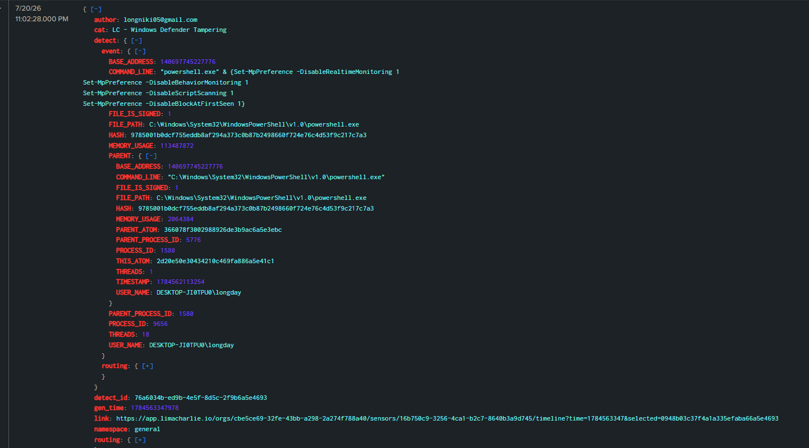

T1685-19 Tamper with Windows Defender ATP PowerShell
**1. Executive Summary**
Trong phiên kiểm thử SOC/SOAR Home Lab, nhóm thực hiện mô phỏng kỹ thuật MITRE ATT&CK T1685 - Disable or Modify Tools bằng Atomic Red Team, bài test T1685-19 - Tamper with Windows Defender ATP PowerShell. T1685 mô tả hành vi vô hiệu hóa hoặc sửa đổi các công cụ bảo mật nhằm làm suy giảm khả năng phát hiện và bảo vệ của hệ thống.
Bài test sử dụng PowerShell và Set-MpPreference để thử thay đổi bốn chức năng bảo vệ của Microsoft Defender:
Set-MpPreference -DisableRealtimeMonitoring 1
Set-MpPreference -DisableBehaviorMonitoring 1
Set-MpPreference -DisableScriptScanning 1
Set-MpPreference -DisableBlockAtFirstSeen 1
Sysmon, LimaCharlie EDR và Splunk đã ghi nhận đầy đủ process, user context và command line. Custom rule LC - Windows Defender Tampering phát hiện đúng hành vi và alert được chuyển sang DFIR-IRIS để điều tra.
Tuy nhiên, Windows trả về lỗi không đủ quyền cho cả bốn lệnh và Atomic test kết thúc với Exit code 1. Do đó, evidence hiện tại xác nhận hành vi cố gắng can thiệp Microsoft Defender, nhưng không chứng minh các chức năng bảo vệ đã bị vô hiệu hóa thành công.
**2. Incident Classification**
| Hạng mục | Kết quả |
| --- | --- |
| Case Name | T1685-19 - Tamper with Windows Defender ATP PowerShell |
| Classification | True Positive - Authorized Simulation |
| Control Outcome | Tampering Attempt Blocked |
| MITRE Tactic | Defense Evasion |
| MITRE Technique | T1685 - Disable or Modify Tools |
| Atomic Test | Test #19 - Tamper with Windows Defender ATP PowerShell |
| Detection Sources | Sysmon, Splunk, LimaCharlie EDR |
| Case Platform | DFIR-IRIS |
| Affected Host | DESKTOP-JI0TPU0 |
| User | DESKTOP-JI0TPU0\longday |
| Observed Time Window | 20/07/2026, 23:02:25-23:02:29 |
| Business Impact | None |
| Containment Required | No |
| Final Status | Ready for closure after Defender state validation |

**3. ****Scope**** ****and**** ****Environment**
Bài kiểm thử được thực hiện trên Windows 10 victim trong môi trường home lab có kiểm soát, phục vụ mục tiêu:
Kiểm tra khả năng phát hiện hành vi can thiệp Microsoft Defender.
Xác thực telemetry giữa Sysmon và LimaCharlie EDR.
Kiểm tra pipeline Splunk → DFIR-IRIS.
Thực hành quy trình triage và investigation cho kỹ thuật Defense Evasion.

Kiểm tra alert trên DFIR-IRIS thì phát hiện 6 alert lần lượt được đẩy lên trong cùng 1 khung thời gian và tiến hành kiểm tra phần raw log được đẩy lên trong từng alert và tôi phát hiện Tag HIGH được gắn trên các alert và **risk_score:**70 nên tôi tiến hành tự assign và merge thành case và bắt đầu phân tích luôn.

Mở Dashboard EDR Limacharlie trên splunk xem xét xem thời gian có trùng khớp với lúc báo alert avf phát hiện trong mục **Suspicious**** ****Process**** ****Executions**** **đang có xuất hiện 1 tiến trình chạy bằng powershell. Và tiến hành đánh dấu tạm mốc thời gian và kiểm tra kỹ hơn qua các index.

**4. Detection Overview**
Sau khi Atomic Red Team thực thi bài test, LimaCharlie EDR ghi nhận các event liên quan đến:
- HOSTNAME.EXE
- whoami.exe
- powershell.exe
- __PSScriptPolicyTest_*.ps1
- Set-MpPreference
- consent.exe
Các detection xuất hiện trong cùng time window gồm:
- Suspicious Execution of Hostname
- Local Accounts Discovery
- LC - Windows Defender Tampering
Trong đó, rule **LC - Windows Defender Tampering** là detection chính, match command line chứa bốn tham số sửa đổi Microsoft Defender.

5. Technical Timeline
Đối chiếu dữ liệu trên LimaCharlie EDR với index=win10sysmon, xác định chuỗi hoạt động chính của bài test T1685-19 - Tamper with Windows Defender ATP PowerShell diễn ra trong khoảng thời gian từ 23:02:25 đến 23:02:29

**Map**** ATT&CK T1685 ****-**** ****Disable**** ****or**** ****Modify**** ****Tools**
1.Atomic Red Team khởi chạy các tiến trình HOSTNAME.EXE và whoami.exe nhằm xác định hostname, user context và môi trường đang thực thi bài test.
2.Một tiến trình powershell.exe mới được tạo với PID 9656, có parent là một tiến trình PowerShell khác. Đây là tiến trình thực thi payload chính của bài test.
3.PowerShell lần lượt gọi bốn lệnh Set-MpPreference:
- Set-MpPreference -DisableRealtimeMonitoring 1
- Set-MpPreference -DisableBehaviorMonitoring 1
- Set-MpPreference -DisableScriptScanning 1
- Set-MpPreference -DisableBlockAtFirstSeen 1
4.Các lệnh trên nhằm làm suy yếu nhiều lớp bảo vệ của Microsoft Defender, bao gồm:
- Real-time monitoring.
- Behavior monitoring.
- PowerShell/script scanning.
- Block at First Seen.
5.Trong quá trình PowerShell thực thi, file tạm dạng __PSScriptPolicyTest_*.ps1 được tạo trong thư mục %TEMP%. Đây là artifact thường xuất hiện khi PowerShell kiểm tra chính sách thực thi script.
6.Nhiều tiến trình consent.exe được ghi nhận ngay sau khi payload chạy. Sự kiện này phù hợp với việc bài Atomic yêu cầu quyền nâng cao và Windows kích hoạt thành phần xử lý UAC.

Timeline
| Giờ | PID | Sự kiện | Ý nghĩa |
| --- | --- | --- | --- |
| 23:02:25 | 2520 | HOSTNAME.EXE được khởi chạy | Xác định hostname và context của endpoint trước khi thực hiện bài test |
| 23:02:25 | 5536 | whoami.exe được khởi chạy | Kiểm tra user đang thực thi và quyền hiện tại |
| 23:02:27 | 9656 | powershell.exe được tạo, parent cũng là PowerShell | Payload chính của Atomic Red Team bắt đầu thực thi |
| 23:02:27 | 9656 | Thực thi Set-MpPreference -DisableRealtimeMonitoring 1 | Yêu cầu tắt chức năng giám sát thời gian thực của Microsoft Defender |
| 23:02:27 | 9656 | Thực thi Set-MpPreference -DisableBehaviorMonitoring 1 | Yêu cầu tắt cơ chế giám sát hành vi |
| 23:02:27 | 9656 | Thực thi Set-MpPreference -DisableScriptScanning 1 | Yêu cầu tắt chức năng quét nội dung script |
| 23:02:27 | 9656 | Thực thi Set-MpPreference -DisableBlockAtFirstSeen 1 | Yêu cầu tắt cơ chế Block at First Seen |
| 23:02:27 | 9656 | Tạo file __PSScriptPolicyTest_5y1avqxm.tvl.ps1 trong thư mục Temp | Artifact nội bộ xác nhận PowerShell đã thực hiện kiểm tra script execution policy |
| 23:02:27 | 8456, 5392 | HOSTNAME.EXE được chạy thêm hai lần | Kiểm tra lại thông tin môi trường trong quá trình thực thi Atomic test |
| 23:02:27 | 2520, 5536 | HOSTNAME.EXE và whoami.exe kết thúc | Các tiến trình kiểm tra context ban đầu hoàn tất |
| 23:02:28 | 8276 | wmiprvse.exe được tạo dưới tài khoản LOCAL SERVICE | Hoạt động hệ thống/WMI xuất hiện cùng time window; là evidence phụ, chưa đủ để kết luận malicious |
| 23:02:28 | 1696, 11068, 11184, 2740, 5736 | Nhiều tiến trình consent.exe được tạo | Windows xử lý yêu cầu elevation/UAC do bài test yêu cầu chạy với quyền nâng cao |
| 23:02:29 | - | Ghi nhận Code Identity đối với wmsgapi.dll | Artifact liên quan hoạt động WMI; không phải chỉ báo trọng tâm của kỹ thuật Defender tampering |
| 23:02:29 | 9656 | powershell.exe kết thúc | Payload chính hoàn thành việc thực thi bốn lệnh Set-MpPreference |
| 23:02:29 | 1696, 5736, 8456, 5392, 11068, 11184, 2740 | Các tiến trình con kết thúc | Chuỗi thực thi Atomic test kết thúc và các process ngắn hạn được dọn dẹp |

Đối chiếu dữ liệu với các Index sysmon và edr trên Splunk trong khoảng thời gian tương tự và phát hiện các hoạt động đều log đúng

Các alert được Limacharlie đẩy lên splunk cũng theo thứ tự tương tự với các rule
Suspicious Execution of Hostname
Local Accounts Discovery
Suspicious Execution of Hostname
Và đặc biệt là 1 rule của tôi tạo ra cũng đã match rule đó là **LC - Windows ****Defender**** ****Tampering**** **đã phát hiện được hành vi dùng powershel để thực thì tắt giám sát hành vi, tắt quét các lệnh thực thi , và tắt tính năng bảo mật cực kỳ quan trọng nằm trong thành phần **Antivirus** của hệ điều hành Windows. Đây là cơ chế **giết nhầm còn hơn bỏ sót** dựa trên sức mạnh của điện toán đám mây để ngăn chặn các loại mã độc dạng *Zero**-**day.*

**6. Process Chain Analysis**
Process chain quan sát được:
Invoke-AtomicTest
└── powershell.exe
├── HOSTNAME.EXE
├── whoami.exe
└── powershell.exe - PID 9656
├── Set-MpPreference -DisableRealtimeMonitoring 1
├── Set-MpPreference -DisableBehaviorMonitoring 1
├── Set-MpPreference -DisableScriptScanning 1
├── Set-MpPreference -DisableBlockAtFirstSeen 1
└── __PSScriptPolicyTest_*.ps1
**7. Defender State Validation**
Kết quả Atomic chỉ chứng minh command được thực thi và bị từ chối
*Get-**MpPreference** \|*
*Select-Object **DisableRealtimeMonitoring**,*
*              **DisableBehaviorMonitoring**,*
*              **DisableScriptScanning**,*
*              **DisableBlockAtFirstSeen*
Kết quả an toàn:
*DisableRealtimeMonitoring** :** False*
*DisableBehaviorMonitoring** :** False*
*DisableScriptScanning**   **  :** False*
*DisableBlockAtFirstSeen** **  :** False*
**8. Network and IOC Review**
Bài test không tạo domain, IP, URL hoặc file hash độc hại cần enrichment qua MISP hoặc VirusTotal.
**9. ****Impact**** ****Assessment**
| Impact Area | Assessment |
| --- | --- |
| Security Control Tampering | Hành vi cố gắng can thiệp được xác nhận |
| Defender Configuration Change | Không được chứng minh; command bị từ chối |
| Endpoint Compromise | Không ghi nhận |
| Persistence | Không ghi nhận |
| Credential Access | Không ghi nhận |
| Lateral Movement | Không ghi nhận |
| C2 Communication | Không ghi nhận |
| Data Exfiltration | Không ghi nhận |
| Business Impact | None |

**10. Containment Decision**
**Quyết**** ****định**
- Containment Required: No
- Endpoint Isolation: Not required
- Process Kill: Not required
- Account Disable: Not required
- Defender Remediation: Verify configuration state
**Lý do**
- Hành vi được tạo bởi Atomic Red Team trong phạm vi kiểm thử.
- Các lệnh thay đổi Defender bị Windows từ chối.
- Không có external IOC.
