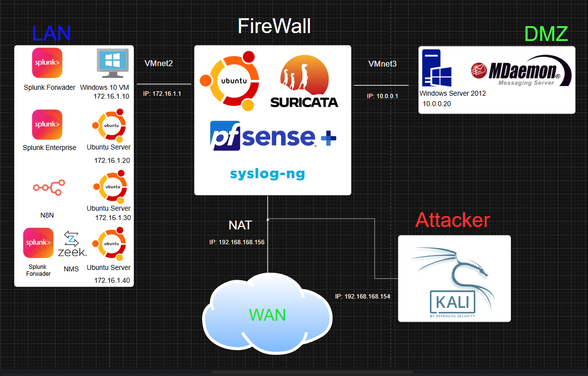
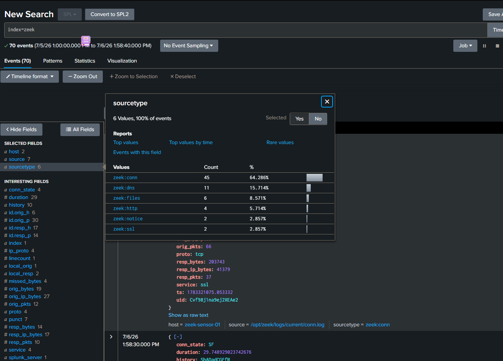
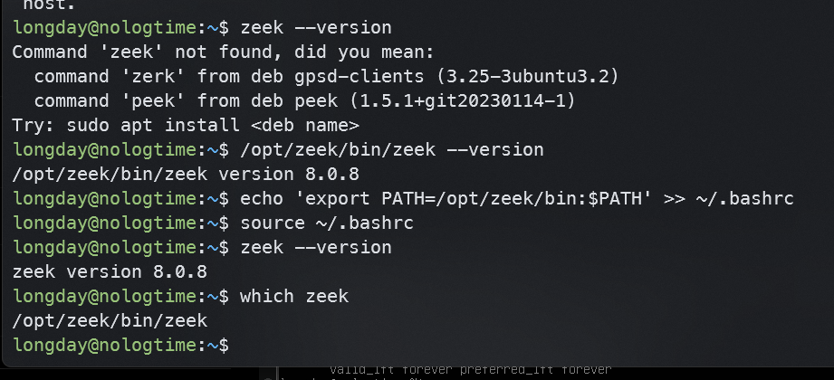
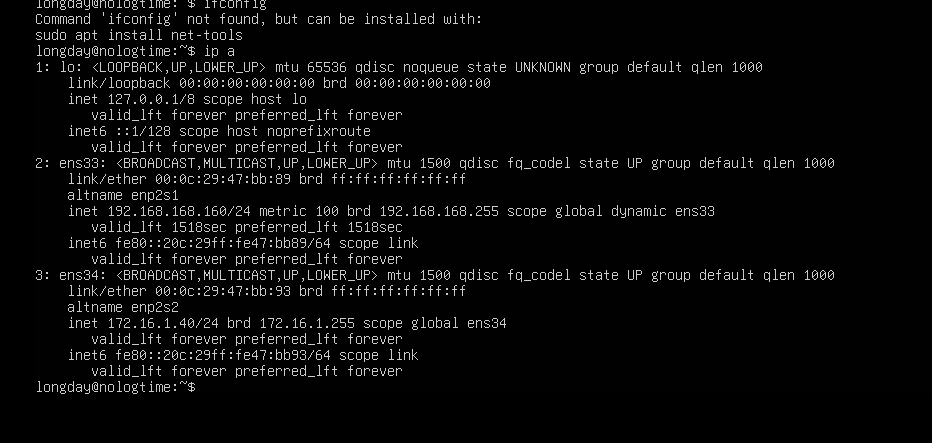
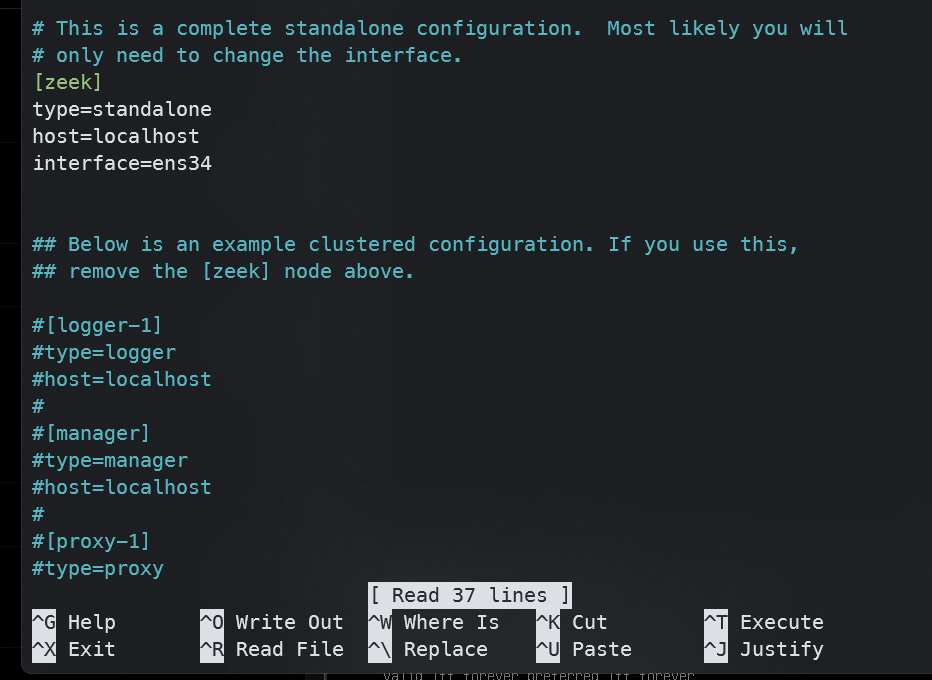
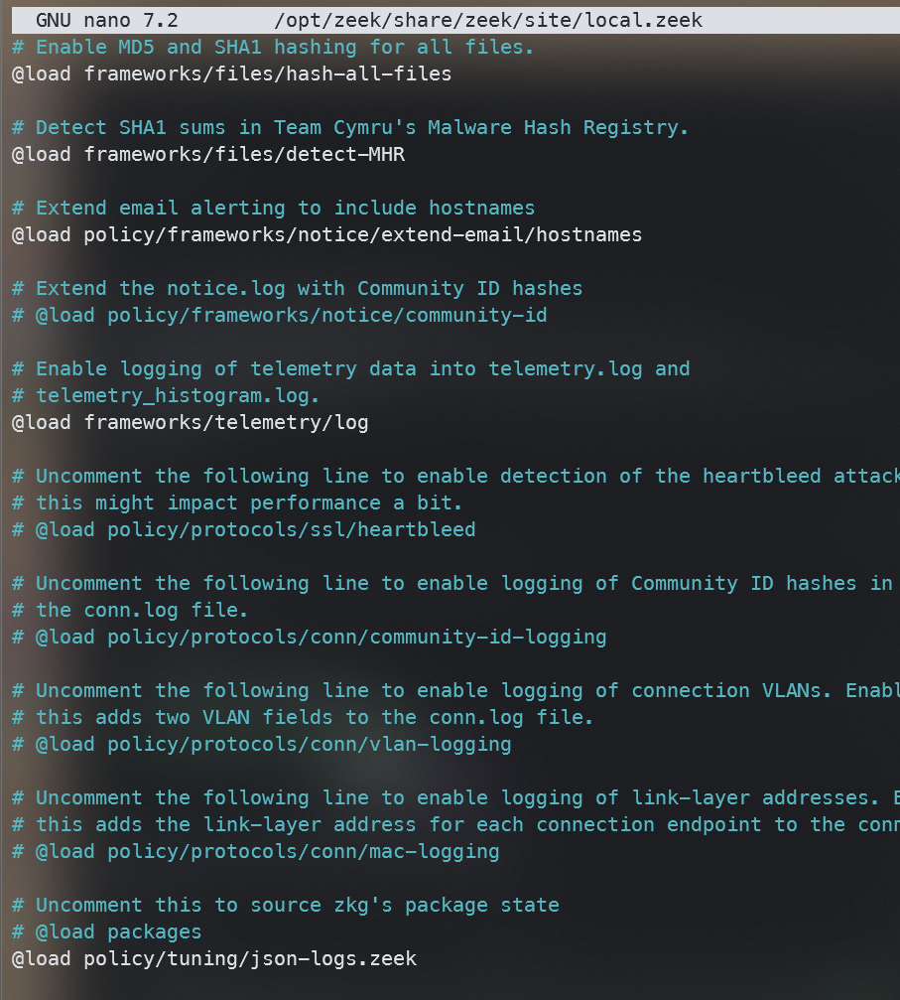
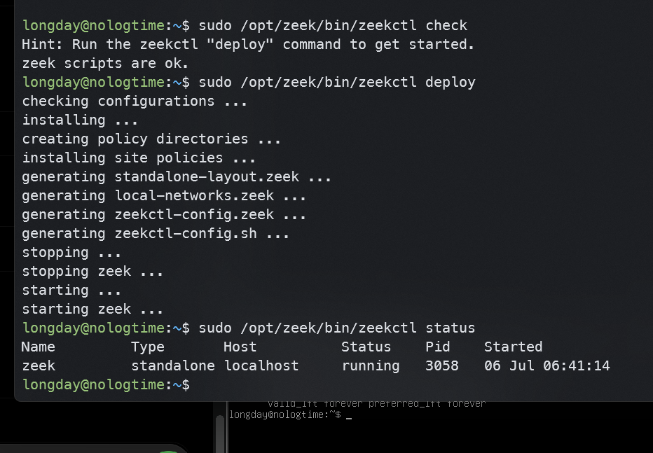
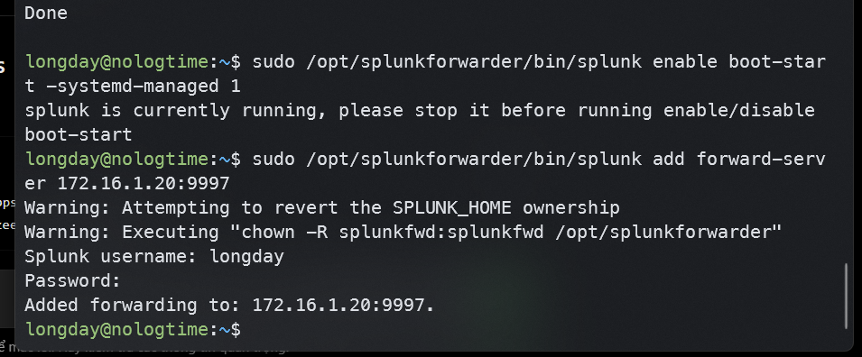
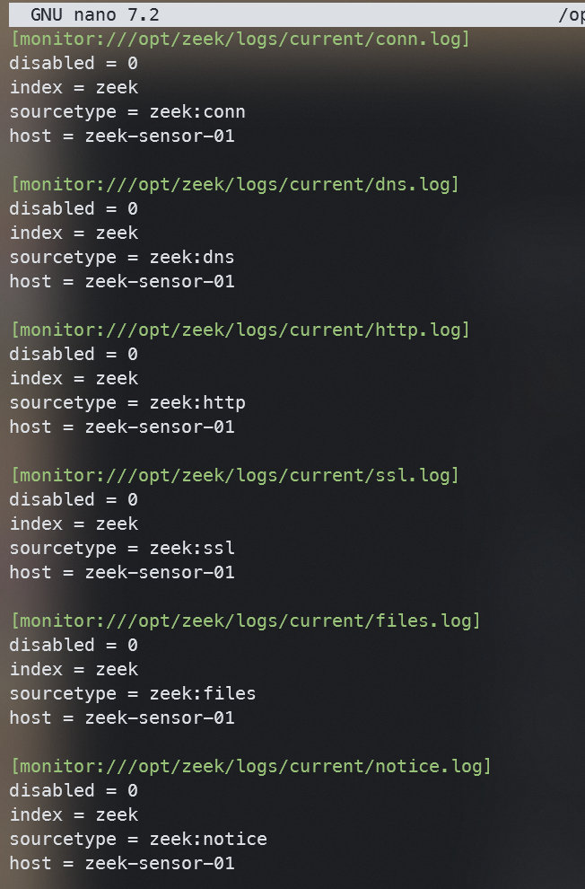
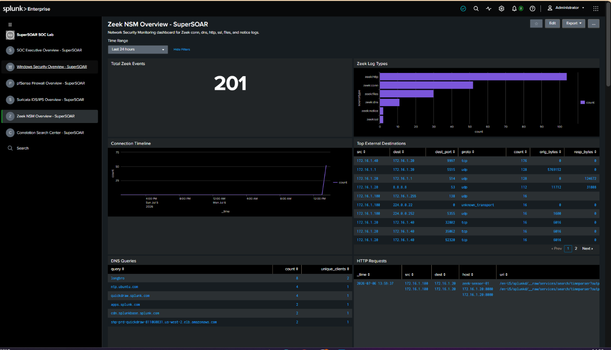

**Báo**** ****cáo****: ****Tích**** ****hợp**** ****Zeek**** NSM ****vào**** ****SuperSOAR**** ****HomeLab**
**1. ****Tổng**** ****quan**
Dự án này mở rộng kiến trúc SuperSOAR HomeLab bằng cách bổ sung giải pháp Zeek Network Security Monitoring (NSM) làm một nguồn thu thập network telemetry độc lập. Zeek được triển khai dưới dạng một network sensor nhằm mục đích capture và trích xuất các metadata có cấu trúc từ lưu lượng mạng nội bộ. Dữ liệu này sau đó được forward trực tiếp về Splunk Enterprise để tiến hành phân tích và trực quan hóa.
Mục tiêu cốt lõi của giai đoạn này là gia tăng khả năng hiển thị mạng  vượt ra khỏi giới hạn của các cảnh báo Firewall hay IDS truyền thống. Quá trình này tập trung vào việc thu thập metadata ở tầng giao thức, bao gồm thông tin chi tiết về các connection, truy vấn DNS, request HTTP, phiên TLS/SSL, tệp tin và các notice từ hệ thống.
**2. ****Mục**** ****tiêu**** ****triển**** ****khai**
Triển khai Zeek đóng vai trò là một NSM sensor chuyên dụng.
Thu thập network metadata từ traffic của hệ thống lab.
Thiết lập quá trình forward log từ Zeek đến Splunk Enterprise.
Khởi tạo không gian lưu trữ độc lập trên Splunk qua index=zeek.
Xây dựng Zeek NSM Dashboard phục vụ giám sát tập trung.
Chuẩn bị nền tảng dữ liệu Zeek để thực hiện correlation với pfSense, Suricata, Sysmon và các workflow của SOAR trong tương lai.
**3. ****Kiến**** ****trúc**** ****mạng**
Plaintext
Windows 10 Victim / Kali / pfSense LAN
↓
Ubuntu Zeek Sensor
↓
Zeek Log Files
↓
Splunk Universal Forwarder
↓
Splunk Enterprise
↓
index=zeek
↓
Zeek NSM Dashboard / Correlation Search
**Data Flow:**
Network Traffic --> Zeek Sensor --> conn.log / dns.log / http.log / ssl.log / files.log / notice.log --> Splunk Universal Forwarder --> Splunk index=zeek --> Zeek NSM Dashboard
**4. ****Các**** ****thành**** ****phần**** ****hệ**** ****thống**

**5. Danh mục ****Zeek**** ****Log**** thu thập**
Quá trình tích hợp đã đẩy thành công các loại log đặc thù sau của Zeek vào Splunk:
| Sourcetype | Cấu trúc dữ liệu ghi nhận |
| --- | --- |
| zeek:conn | Metadata của các network connection (TCP/UDP/ICMP...). |
| zeek:dns | Các truy vấn DNS và thông tin response tương ứng. |
| zeek:http | Chi tiết các request và response qua giao thức HTTP. |
| zeek:ssl | Thông tin bắt tay mã hóa và metadata của phiên TLS/SSL. |
| zeek:files | Metadata của các tệp tin được truyền tải qua mạng. |
| zeek:notice | Các alert được kích hoạt dựa trên script policy của Zeek. |

**X****ác thực trên ****Splunk****:**

*Kết quả:* Hệ thống ghi nhận đầy đủ các sourcetype định tuyến vào Splunk bao gồm: zeek:conn, zeek:dns, zeek:http, zeek:ssl, zeek:files và zeek:notice.

**5.****Triển khai ****Zeek**** đóng vai trò là một NSM ****sensor**** chuyên dụng.**
echo 'deb https://download.opensuse.org/repositories/security:/zeek/xUbuntu_24.04/ /' \| sudo tee /etc/apt/sources.list.d/security:zeek.list
curl -fsSL https://download.opensuse.org/repositories/security:zeek/xUbuntu_24.04/Release.key \| gpg --dearmor \| sudo tee /etc/apt/trusted.gpg.d/security_zeek.gpg > /dev/null

sudo apt install zeek-8.0 -y

Cấu hình 2 card mạng 1 card để tải các gói và 1 card ens34 dùng để thêm vào vùng LAN

Sửa interface thành card LAN
sudo nano /opt/zeek/etc/node.cfg

Thêm Zeek vào PATH:
echo 'export PATH=/opt/zeek/bin:$PATH' >> ~/.bashrc
source ~/.bashrc
Bật JSON log cho Zeek
sudo nano /opt/zeek/share/zeek/site/local.zeek
thêm @load policy/tuning/json-logs.zeek vào cuối file

Deploy Zeek bằng các lệnh
sudo /opt/zeek/bin/zeekctl check
sudo /opt/zeek/bin/zeekctl deploy
sudo /opt/zeek/bin/zeekctl status

Sau đó lên Splunk webUI đẻ tạo index mới tên zeek
Cài Splunk Universal Forwarder trên Ubuntu Zeek
Sau đó khai báo forward về Splunk Server
sudo /opt/splunkforwarder/bin/splunk start --accept-license
sudo /opt/splunkforwarder/bin/splunk enable boot-start -systemd-managed 1
sudo /opt/splunkforwarder/bin/splunk add forward-server 172.16.1.20:9997
Test

Tạo inputs cho Zeek logs
sudo mkdir -p /opt/splunkforwarder/etc/apps/zeek_inputs/local
sudo nano /opt/splunkforwarder/etc/apps/zeek_inputs/local/inputs.conf

Kiểm tra trong Splunk và log đã được đẩy lên

**6****. ****Zeek**** NSM ****Dashboard**
Giao diện trực quan hóa dữ liệu **Zeek**** NSM ****Overview**** - ****SuperSOAR** build hoàn chỉnh trên Splunk, tập trung vào các panel giám sát sau:
**Total ****Zeek**** ****Events**:
index=zeek earliest=$time.earliest$ latest=$time.latest$ \| stats count
**Zeek**** Log ****Types****:**
index=zeek earliest=$time.earliest$ latest=$time.latest$ \| stats count by sourcetype \| sort - count
**Connection ****Timeline****:**
index=zeek sourcetype=zeek:conn earliest=$time.earliest$ latest=$time.latest$ \| timechart span=30m count
**Top External De****stinations****:**
index=zeek sourcetype=zeek:conn earliest=$time.earliest$ latest=$time.latest$
\| spath
\| eval src=coalesce('id.orig_h',src_ip), dest=coalesce('id.resp_h',dest_ip), dest_port=coalesce('id.resp_p',dest_port), proto=coalesce(proto,proto)
\| stats count sum(orig_bytes) as orig_bytes sum(resp_bytes) as resp_bytes by src dest dest_port proto
\| sort - count
\| head 20
**DNS ****Queries****:**
index=zeek sourcetype=zeek:dns earliest=$time.earliest$ latest=$time.latest$
\| spath
\| eval src=coalesce('id.orig_h',src_ip), query=coalesce(query,'dns.rrname')
\| stats count dc(src) as unique_clients by query
\| sort - count
\| head 25
**HTTP ****Requests****:**
index=zeek sourcetype=zeek:http earliest=$time.earliest$ latest=$time.latest$
\| spath
\| eval src=coalesce('id.orig_h',src_ip), dest=coalesce('id.resp_h',dest_ip)
\| table _time src dest host uri method user_agent status_code
\| sort - _time
\| head 50

**7****. ****Đánh**** ****giá**** ****khả**** ****năng**** ****hiển**** ****thị**
Sau khi deploy, sensor đã thu thập và bóc tách thành công các luồng traffic tiêu biểu:
**Khả**** ****năng**** ****giám**** ****sát**** DNS**
Ghi nhận rõ ràng các truy vấn phân giải tên miền từ nội bộ, ví dụ: ntp.ubuntu.com, quickdraw.splunk.com, apps.splunk.com. Giúp nhanh chóng audit các domain lạ.
**Khả**** ****năng**** ****giám**** ****sát**** HTTP**
Log zeek:http cung cấp toàn bộ metadata của các phiên HTTP cleartext bao gồm URI, host, và user-agent, hỗ trợ phát hiện các request tải payload bất thường.
**Khả**** ****năng**** ****giám**** ****sát**** Connection**
Đặc tả chi tiết các luồng giao tiếp với IP nguồn, IP đích, port, giao thức, dung lượng truyền tải và connection state. Trực tiếp phục vụ cho việc detect hành vi scan mạng hoặc C2 beaconing.
**8****. ****Các**** Use Case ****phân**** ****tích**** ****bảo**** ****mật**
Dữ liệu từ Zeek cung cấp input chất lượng để xây dựng các SOC Use Case sau:
| Tên Use Case | Nguồn Log Zeek phụ thuộc |
| --- | --- |
| Truy vấn phân giải các malicious domain | zeek:dns |
| Tải payload từ các host độc hại qua web | zeek:http, zeek:files |
| Hành vi Port Scanning nội bộ | zeek:conn |
| Luồng outbound traffic bất thường | zeek:conn |
| Header TLS SNI sai lệch hoặc đáng ngờ | zeek:ssl |
| Truyền file nghi ngờ qua HTTP | zeek:http, zeek:files |
| Bất thường kích hoạt từ policy Zeek | zeek:notice |

**9****. ****Tổng**** ****kết**
Giai đoạn nâng cấp này đã tích hợp hoàn hảo Zeek vào kiến trúc SuperSOAR HomeLab với vai trò là một NSM sensor chuyên dụng. Các luồng metadata mạng có cấu trúc đang được đẩy ổn định vào index=zeek, mở ra khả năng visibility sâu rộng đối với các activity của DNS, HTTP, TLS, file transfer và connection.
Hệ thống lab hiện tại đã đảm bảo năng lực SOC coverage trên 3 vector chủ chốt:
**Endpoint Telemetry:** Windows Event Log, Sysmon, PowerShell.
**Security Device Telemetry:** pfSense, Suricata.
**Network Telemetry:** Zeek.
Mô hình này hoàn toàn đủ độ chín để bước sang phase kế tiếp: Triển khai LimaCharlie EDR và xây dựng các workflow tự động hóa phản hồi sự cố.
