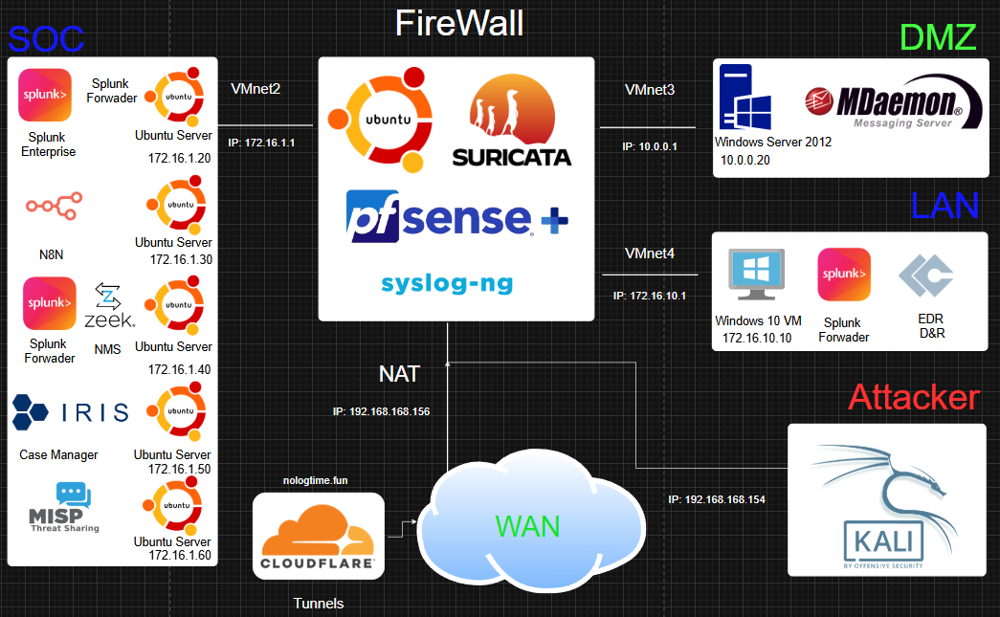
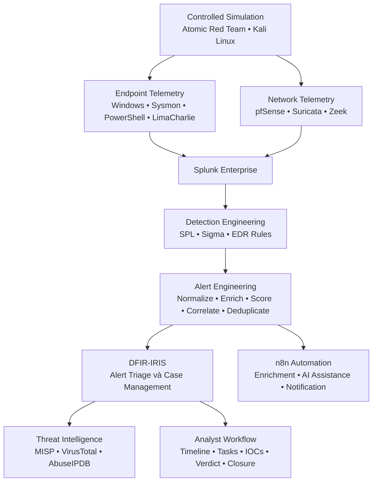
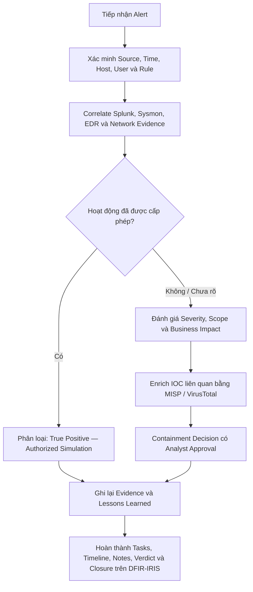

<div align="center">


<p>
  
  
  
</p>

<p>
  
  
  
  
  
</p>

<p>
  
  
  
  
  
</p>

### Phòng lab Blue Team kết nối Telemetry, Detection, Enrichment, Case Management và Incident Response

[Kiến trúc](#kiến-trúc-hệ-thống-architecture) ·
[Detection Pipeline](#quy-trình-detection-to-response) ·
[Kịch bản kiểm thử](#các-kịch-bản-tấn-công-đã-kiểm-thử) ·
[Incident Workflow](#quy-trình-ứng-phó-sự-cố-incident-response-workflow) ·
[Roadmap](#lộ-trình-phát-triển-engineering-roadmap)

</div>

---

## Tổng quan dự án (Executive Summary)

**SuperSOC / SuperSOAR HomeLab** là phòng lab Security Operations Center được xây dựng trên VMware để thực hành trọn vẹn quy trình **Detection-to-Response**:

1. thu thập Telemetry từ Endpoint, Firewall, IDS/IPS, Network và EDR;
2. tập trung hóa, tìm kiếm và điều tra sự kiện trên Splunk Enterprise;
3. xây dựng Detection bằng SPL, Sigma và custom EDR rules;
4. chuẩn hóa dữ liệu, bổ sung Asset Context, tính Risk Score, Correlation và Deduplication;
5. làm giàu IOC bằng các nguồn Threat Intelligence;
6. tạo Alert, quản lý Case và theo dõi Investigation trên DFIR-IRIS;
7. kiểm thử khả năng phát hiện bằng Atomic Red Team và các mô phỏng có kiểm soát từ Kali Linux;
8. tài liệu hóa Timeline, Evidence, Verdict, Response Decision và Lessons Learned.

Dự án không được giới thiệu như một Production SOC hoặc nền tảng tự động phản ứng hoàn toàn. Đây là một **Controlled HomeLab** nhằm chứng minh năng lực thực hành SOC Analysis, Detection Engineering, Security Automation, Threat Validation và Incident Documentation.

### Năng lực kỹ thuật được thể hiện

| Năng lực | Cách triển khai thực tế |
|---|---|
| Centralized Monitoring | Splunk Enterprise tiếp nhận Windows, Sysmon, PowerShell, pfSense, Suricata, Zeek và LimaCharlie Telemetry |
| Endpoint Visibility | Windows Event Logs, Sysmon, PowerShell Logging, Splunk Universal Forwarder và LimaCharlie EDR |
| Network Visibility | pfSense Firewall Logs, Suricata Alerts và Zeek Network Metadata |
| Detection Engineering | SPL Correlation Searches, EDR Detection Rules, Sigma Rules, Allowlists và MITRE ATT&CK Mapping |
| Alert Engineering | Field Normalization, Asset Enrichment, Severity/Risk Scoring, Time-window Correlation và Deduplication |
| Security Orchestration | n8n Workflows phục vụ Enrichment, AI-assisted Analysis có kiểm soát và Notification |
| Incident Response | DFIR-IRIS hỗ trợ Alert Triage, Case Creation, Assignment, Tasks, Timeline, IOC Handling, Notes và Closure |
| Threat Intelligence | MISP, VirusTotal và AbuseIPDB được sử dụng khi Case có Observable phù hợp |
| Adversary Emulation | Atomic Red Team và Kali Linux được sử dụng trong môi trường cô lập, có kiểm soát |
| Analyst Reporting | Investigation Reports có Process Chain, Screenshots, SPL Evidence, Impact Assessment và Verdict |

---

## Kiến trúc hệ thống (Architecture)

### Trạng thái phân vùng mạng

Repository phân biệt rõ **Current Lab Deployment** và **Target Segmented Architecture**. Cách trình bày này vẫn thể hiện tư duy thiết kế mạng chuyên nghiệp nhưng không biến một biện pháp bảo mật chưa triển khai thành thông tin sai.

| Hạng mục | Mô hình đang triển khai | Thiết kế Hardening mục tiêu |
|---|---|---|
| SOC Services | VMnet2 — `172.16.1.0/24` | VMnet2 — `172.16.1.0/24` |
| Windows 10 Victim | `172.16.1.10`, đang dùng chung VMnet2 | VMnet4 — `172.16.10.10`, tách thành Endpoint/LAN riêng |
| LAN Gateway | Dùng chung pfSense Interface `172.16.1.1` | Dedicated pfSense VMnet4 Interface `172.16.10.1` |
| Isolation Model | Giới hạn tài nguyên HomeLab nên các máy dùng chung Internal Virtual Segment | Inter-zone Filtering, Least Privilege và Default-deny giữa LAN, SOC, DMZ và WAN |
| Sơ đồ bên dưới | Thể hiện Target Architecture | Planned Segmentation / Hardening Milestone |

> [!IMPORTANT]
> VMnet4 với subnet `172.16.10.0/24` trong sơ đồ là **Target Architecture**, chưa phải bằng chứng rằng VMnet4 đã được triển khai. Windows 10 Victim hiện vẫn sử dụng địa chỉ `172.16.1.10` cho đến khi hoàn thành Migration, Firewall Rules và Validation.

### Target Segmented Architecture

<p align="center">
  
</p>

<p align="center"><em>Thiết kế mục tiêu: SOC Services trên VMnet2, DMZ trên VMnet3, Victim Endpoint trên VMnet4 dự kiến và Attack Traffic có kiểm soát từ VMware NAT/WAN.</em></p>

### Danh sách tài sản hiện tại (Current Asset Inventory)

| Vùng mạng | Thành phần | Địa chỉ | Vai trò chính |
|---|---|---:|---|
| SOC / VMnet2 | pfSense Internal Gateway | `172.16.1.1` | Routing, Firewall Policy, NAT và tích hợp IDS/IPS |
| SOC / VMnet2 | Windows 10 Victim | `172.16.1.10` | Endpoint Telemetry và mục tiêu mô phỏng tấn công |
| SOC / VMnet2 | Splunk Enterprise | `172.16.1.20` | SIEM, Search, Dashboard, Correlation và Alerting |
| SOC / VMnet2 | n8n | `172.16.1.30` | Enrichment, Workflow Orchestration và Notification |
| SOC / VMnet2 | Zeek NSM | `172.16.1.40` | Network Metadata và Protocol Visibility |
| SOC / VMnet2 | DFIR-IRIS | `172.16.1.50` | Alert Triage, Case Management, Tasks và Investigation Timeline |
| SOC / VMnet2 | MISP | `172.16.1.60` | Threat Intelligence và IOC Context |
| DMZ / VMnet3 | Windows Server 2012 R2 | `10.0.0.20` | MDaemon Mail, DNS và IIS Lab Services |
| WAN / VMware NAT | Kali Linux | `192.168.168.154` | Authorized Adversary Emulation |

### Target Firewall Policy

Kế hoạch Migration sang VMnet4 hướng đến Policy sau:

| Nguồn | Đích | Service | Policy | Mục đích |
|---|---|---|---|---|
| Endpoint LAN | Splunk | TCP `9997` | Allow | Truyền Telemetry từ Splunk Universal Forwarder |
| Endpoint LAN | LimaCharlie Cloud | HTTPS `443` | Allow | EDR Sensor Communication |
| Endpoint LAN | SOC Services | Các dịch vụ khác | Deny by default | Hạn chế Endpoint truy cập Management Plane |
| SOC Admin Hosts | Endpoint LAN | Chỉ các Management Ports cần thiết | Restricted allow | Investigation và Administration đã được phê duyệt |
| DMZ | SOC Collectors | Các Log-ingestion Ports đã cấu hình | Restricted allow | Centralized Logging nhưng không mở rộng quyền truy cập từ DMZ |
| WAN / Attacker Zone | Internal Zones | Chỉ các Test Services được chỉ định | Deny by default | Giữ Attack Simulation đúng phạm vi và có thể tái lập |

---

## Quy trình Detection-to-Response



### Các giai đoạn xử lý

| Giai đoạn | Trọng tâm kỹ thuật | Kết quả |
|---|---|---|
| 1. Collection | Thu thập có chọn lọc Endpoint và Network Telemetry để kiểm soát Noise | Các Event có thể tìm kiếm trên Splunk |
| 2. Normalization | Ánh xạ các Field khác nhau về Host, User, Process, Network, Rule và Severity thống nhất | Detection Schema ổn định |
| 3. Context | Bổ sung Asset Role, Criticality, Owner, Zone và Allowlist Context khi có dữ liệu | Event có đủ ngữ cảnh cho Analyst |
| 4. Detection | Áp dụng SPL, Sigma-aligned Logic, EDR Rules, Threshold và Behavioral Pattern | Candidate Security Events |
| 5. Correlation | Nhóm Activity theo Host, Rule, Process Chain và Time Window | Một Activity Chain thay vì nhiều Micro-alert rời rạc |
| 6. Risk Scoring | Kết hợp Source Severity, Rule Confidence, Asset Value và Behavior | Alert được ưu tiên theo rủi ro |
| 7. Deduplication | Loại Alert lặp nhưng vẫn giữ Representative Evidence | Giảm Alert Fatigue |
| 8. Case Creation | Gửi Normalized Payload sang DFIR-IRIS | Alert hoặc Case sẵn sàng cho Triage |
| 9. Enrichment | Truy vấn MISP, VirusTotal hoặc AbuseIPDB khi có Observable phù hợp | IOC Reputation và Threat Context |
| 10. Investigation | Xây dựng Timeline, Process Tree, Impact Assessment và Response Decision | Incident Verdict có bằng chứng |

### Operational Timing

Thiết kế hiện tại chủ động tách **Telemetry Latency** khỏi **Consolidated Alert Latency**:

| Hạng mục đo lường | Hành vi dự kiến |
|---|---|
| Raw Telemetry | Được Ingest gần Real Time, tùy cấu hình Source và Forwarder |
| Scheduled Detection | Chạy theo lịch của Splunk Saved Search |
| Correlation Window | Có thể chờ vài phút để thu thập đầy đủ Activity Chain |
| DFIR-IRIS Alert | Được tạo sau khi hoàn tất Normalization, Scoring và Deduplication |

Vì vậy, dự án không sử dụng tuyên bố tuyệt đối kiểu “mọi phản hồi đều dưới 60 giây”. Một khoảng trễ ngắn có thể là **Engineering Trade-off** có chủ đích để chuyển nhiều Event ít ngữ cảnh thành một Investigation Unit có chất lượng cao hơn.

---

## Telemetry và Data Sources

| Nguồn dữ liệu | Event hoặc dữ liệu chính | Giá trị phát hiện |
|---|---|---|
| Windows Security | Authentication, Privilege Use, Account Changes, Scheduled Tasks, Service Installation và Log Clearing | Identity Activity, Persistence và Privilege Escalation |
| Sysmon | Process Creation, Network Connection, Image Load, Process Access, File, Registry, DNS và Process Tampering | Process Chain và Endpoint Investigation |
| PowerShell Operational | Event ID `4103` và `4104` | Script Content, Suspicious Command và Encoded Execution |
| LimaCharlie EDR | Detection, Process/Network Telemetry và Sensor Context | High-confidence Endpoint Behavior và Cross-source Validation |
| pfSense | Filter Action, Source/Destination, Port và Interface | Scanning, Blocked Traffic và Perimeter Activity |
| Suricata | IDS/IPS Signature Alerts | Network Threat Detection và Signature Context |
| Zeek | Connection và Protocol Metadata | Network Forensics và Behavioral Context |
| MISP | IOC Attributes, Tags, Events và Related Intelligence | Threat-context Enrichment |

Các Splunk Index tiêu biểu xuất hiện trong tài liệu của Lab:

```text
win10eventlog   win10sysmon   win10powershell
edr             pfsense       suricata         zeek
```

---

## Kỹ thuật phát hiện (Detection Engineering)

### Nguyên tắc xây dựng Detection

- Ưu tiên Behavior và Process Chain thay vì chỉ Match một Filename.
- Luôn giữ Raw Evidence để Analyst có thể xác minh.
- Tách Detection Confidence khỏi Business Impact.
- Phân loại mô phỏng được cấp phép là **True Positive — Authorized Simulation**, không coi là False Positive.
- Sử dụng Allowlist có phạm vi hẹp và ghi rõ lý do của từng Exception.
- Chỉ MITRE ATT&CK Mapping khi Telemetry hiện có đủ bằng chứng hỗ trợ.
- Correlate Event trước khi tạo Case nếu một bài Test sinh ra nhiều Alert liên quan.
- Yêu cầu Human Approval trước các Response Action có khả năng gây gián đoạn.

### Ví dụ: UC-001 PowerShell EncodedCommand

Repository có Sigma Rule phát hiện PowerShell hoặc PowerShell Core sử dụng tham số đầy đủ hoặc dạng rút gọn của `EncodedCommand`.

[Xem Sigma Rule](MITRE-ATTACK-Practice/Ransomware-Simulation/Sigma_Rule/T1059.001.yaml)

```yaml
title: UC-001 PowerShell EncodedCommand
status: test
logsource:
  product: windows
  category: process_creation
detection:
  selection_image:
    Image|endswith:
      - '\powershell.exe'
      - '\pwsh.exe'
  selection_encoded_switch:
    CommandLine|re: '(?i)(^|\s)-(e|ec|en|enc|enco|encod|encode|encoded|encodedc|encodedco|encodedcom|encodedcomm|encodedcomma|encodedcomman|encodedcommand)(\s+|:|=)'
  condition: selection_image and selection_encoded_switch
level: medium
```

Rule có xét đến Legitimate Automation, Deployment Tools và Authorized Security Validation trong phần False-positive Considerations. Điều này quan trọng vì Encoded Command là **Suspicious Context**, chưa tự động chứng minh Endpoint đã bị Compromise.

### Cải thiện chất lượng Alert

Giai đoạn phát triển hiện tại tập trung cải thiện Analyst Experience:

- chuẩn hóa Field từ Splunk, Sysmon và LimaCharlie về một Alert Schema;
- bổ sung Asset Metadata từ Lookup có kiểm soát;
- tính Risk Score từ Detection Severity, Confidence và Asset Context;
- nhóm các Detection liên quan trong một Time Window xác định;
- tránh tạo sáu đến tám IRIS Alert riêng cho cùng một Atomic Red Team Activity Chain;
- giữ lại Representative Raw Event và Correlation Metadata;
- tạo Payload nhất quán cho DFIR-IRIS để Triage có thể lặp lại.

---

## Các kịch bản tấn công đã kiểm thử

Toàn bộ hoạt động dưới đây được thực hiện trong phòng lab cô lập, có cấp phép và chỉ phục vụ Defensive Validation.

| Giai đoạn | Kịch bản | ATT&CK Mapping | Bằng chứng chính | Kết quả |
|---|---|---|---|---|
| Execution | PowerShell Download Cradle và Credential-dumping Simulation | [T1059.001](https://attack.mitre.org/techniques/T1059/001/), T1105, T1003 | Sysmon Process/DNS/Network Events, LimaCharlie Detections và Splunk Timeline | True Positive — Authorized Simulation |
| Execution | PowerShell `-e` / EncodedCommand | [T1059.001](https://attack.mitre.org/techniques/T1059/001/) | Sysmon Event ID 1, EDR Cross-check và IRIS Alert | True Positive — Authorized Simulation |
| Execution | Command Shell ghi và thực thi VBScript | [T1059.003](https://attack.mitre.org/techniques/T1059/003/), T1059.005, T1033 | Process Chain `cmd.exe → wscript.exe → whoami.exe` | True Positive — Authorized Simulation |
| Privilege Escalation | Event Viewer UAC Bypass Simulation | [T1548.002](https://attack.mitre.org/techniques/T1548/002/) | Registry Modification, PowerShell, Event Viewer/MMC và Child Process | True Positive — Authorized Simulation |
| Defense Evasion | Microsoft Defender Tampering Attempt | [T1562.001](https://attack.mitre.org/techniques/T1562/001/) | `Set-MpPreference`, Sysmon, LimaCharlie, Splunk và IRIS | Attempt Detected; thay đổi bị hệ thống chặn |
| Discovery | Host, User, Process và File-system Discovery | T1082, T1033, T1057, T1083 | `hostname.exe`, `whoami.exe`, Process và File Events | Được Correlate làm Supporting Context |
| Network | Repeated Blocked Traffic / Scanning | T1595.001 | pfSense, Suricata và Source-IP Aggregation | Detection và Enrichment Workflow đã được kiểm thử |
| Endpoint | LOLBin Execution | T1218, T1105 khi đủ bằng chứng | Process Creation, Command Line, Hash và Network Context | Detection và Enrichment Workflow đã được kiểm thử |

> [!NOTE]
> Tên file báo cáo Defender Tampering hiện giữ nhãn Lab cũ `T1685-19`. Trong README này, hành vi được trình bày theo ATT&CK hiện hành là **Impair Defenses: Disable or Modify Tools (T1562.001)**, đồng thời giữ nguyên Filename để bảo đảm Repository Compatibility.

### Investigation Reports

- [Mô phỏng PowerShell Credential Dumping](MITRE-ATTACK-Practice/Ransomware-Simulation/phase-1-execution/T1059.001-PowerShell.md)
- [PowerShell EncodedCommand — Atomic Test #17](MITRE-ATTACK-Practice/Ransomware-Simulation/phase-1-execution/T1059.001-17PowerShell_Command_Execution.md)
- [Windows Command Shell — Atomic Test #6](MITRE-ATTACK-Practice/Ransomware-Simulation/phase-1-execution/T1059.003-Windows-Command-Shell-Test6.md)
- [Bypass UAC bằng Event Viewer](MITRE-ATTACK-Practice/Ransomware-Simulation/phase-2-privilege-escalation/T1548.002-2_Bypass_UAC_using_Event_Viewer_%28PowerShell%29.md)
- [Microsoft Defender Tampering Attempt](MITRE-ATTACK-Practice/Ransomware-Simulation/phase-3-defense-evasion/T1685-19_Tamper_with_Windows_Defender_ATP_PowerShell.md)
- [MITRE ATT&CK Practice Index](MITRE-ATTACK-Practice/README.md)

---

## Quy trình ứng phó sự cố (Incident Response Workflow)



### Analyst Checklist

1. Xác nhận Detection Source, Rule, Host, User và Time Window.
2. Kiểm tra Raw Event trước khi tin hoàn toàn vào Alert Summary.
3. Tái dựng Parent-child Process Chain.
4. Correlate EDR Telemetry với Sysmon, PowerShell và Network Data.
5. Xác định File, Hash, Domain, IP Address, Registry Key và Command liên quan.
6. Chỉ Enrich những Observable có giá trị đối với Case.
7. Phân biệt rõ Attempted Behavior và Successful Impact.
8. Gán Verdict, Confidence, Severity và Response Decision.
9. Lưu Screenshots, SPL Queries, Timeline Entries, IOCs và Analyst Notes.
10. Chỉ đóng Case khi Evidence hỗ trợ đầy đủ Final Classification.

### Các trường chuẩn trong Case Outcome

| Trường | Giá trị ví dụ |
|---|---|
| Classification | True Positive, Benign Positive, False Positive |
| Context | Authorized Simulation, Administrative Activity, Unknown |
| Confidence | Low, Medium, High |
| Severity | Informational, Low, Medium, High, Critical |
| Impact | None, Attempted, Confirmed |
| Containment | Not Required, Recommended, Required |
| Escalation | Not Required, Tier 2, Incident Response |
| Final Status | Open, Monitoring, Closed after Validation |

---

## Các luồng tự động hóa (Automation Paths)

### Luồng chính tập trung vào DFIR-IRIS

```text
Telemetry
  → Splunk Detection / Correlation
  → Normalization + Asset Context + Risk Scoring
  → Deduplication
  → DFIR-IRIS Alert
  → Analyst Triage / Merge / Case Tasks / Timeline
  → MISP hoặc VirusTotal Enrichment khi phù hợp
  → Verdict và Closure
```

### Luồng n8n Enrichment và Notification

```text
Splunk Alert
  → n8n Webhook
  → Route theo Alert Type
  → AbuseIPDB / VirusTotal Enrichment
  → AI-assisted Summary với Lab Data đã được kiểm soát
  → Telegram Notification
```

Luồng n8n thể hiện khả năng Orchestration và Analyst Assistance. AI Output chỉ được coi là Supporting Context, không thay thế Analyst Verdict; hệ thống cũng không thực hiện Destructive Containment nếu chưa có Human Approval.

---

## Công nghệ sử dụng (Technology Stack)

| Lớp | Công nghệ |
|---|---|
| Virtualization | VMware Workstation |
| Network Security | pfSense, Suricata, syslog-ng |
| Network Monitoring | Zeek |
| SIEM | Splunk Enterprise, Splunk Universal Forwarder |
| Endpoint Telemetry | Windows Event Logs, Sysmon, PowerShell Script Block Logging |
| EDR | LimaCharlie |
| Detection Content | SPL, Sigma, Custom EDR Rules, MITRE ATT&CK |
| SOAR / Automation | n8n, Webhooks, REST APIs, Controlled Scripting |
| Case Management | DFIR-IRIS |
| Threat Intelligence | MISP, VirusTotal, AbuseIPDB |
| Validation | Atomic Red Team, Kali Linux |
| Notification / Assistance | Telegram Bot, Optional Google Gemini Lab Workflow |
| Infrastructure | Ubuntu Server, Windows 10, Windows Server 2012 R2, Cloudflare Tunnel |

---

## Cấu trúc Repository

```text
SOAR_HomeLab/
├── README.md
├── SuperSOAR_homelab/
│   ├── SuperSOAR_HomeLab.md
│   └── SuperSOAR_HomeLab_images/
└── MITRE-ATTACK-Practice/
    ├── README.md
    └── Ransomware-Simulation/
        ├── Sigma_Rule/
        ├── phase-1-execution/
        ├── phase-2-privilege-escalation/
        └── phase-3-defense-evasion/
```

- [Báo cáo triển khai SuperSOAR chi tiết](SuperSOAR_homelab/SuperSOAR_HomeLab.md)
- [MITRE ATT&CK Validation Workspace](MITRE-ATTACK-Practice/README.md)
- [PowerShell Sigma Detection](MITRE-ATTACK-Practice/Ransomware-Simulation/Sigma_Rule/T1059.001.yaml)

---

## Quyết định kỹ thuật và bài học kinh nghiệm

### 1. Một Activity Chain không nên tạo thành tám Alert rời rạc

Atomic Test thường tạo một chuỗi Detection ngắn trong cùng Time Window. Grouping theo Endpoint, Rule Family, Process Chain và Time Window giúp Analyst nhận được một Investigation Unit có ý nghĩa hơn.

### 2. Nhanh nhất chưa chắc hữu ích nhất

Raw Telemetry cần được Ingest nhanh, nhưng Consolidated Alert có thể chủ động chờ Correlation Window. Dự án đo Telemetry Ingestion và Alert Creation thành hai chỉ số riêng.

### 3. Detection không đồng nghĩa với Impact đã xảy ra

Defender Tampering Test tạo Detection hợp lệ, nhưng Windows đã từ chối các thay đổi cấu hình. Kết luận chính xác phải là **Attempt Detected and Blocked**, không phải “Defender đã bị vô hiệu hóa”.

### 4. Threat Intelligence chỉ là Context

IP Reputation Score hoặc Hash Verdict hỗ trợ Investigation nhưng không thể thay thế Process, User, Host, Network và Timeline Analysis.

### 5. Network Segmentation phải được triển khai, không chỉ xuất hiện trên sơ đồ

Việc chuyển Victim Endpoint sang VMnet4 được theo dõi như một Hardening Milestone. Tài liệu chỉ chuyển trạng thái từ “Target” sang “Implemented” sau khi Interface Configuration, Routing, Firewall Rules, Telemetry Flow và Attack-path Tests đều được xác minh.

---

## Lộ trình phát triển (Engineering Roadmap)

| Trạng thái | Milestone |
|---|---|
| ✅ Đã triển khai | Splunk SIEM tiếp nhận Endpoint và Network Telemetry |
| ✅ Đã triển khai | Sysmon, PowerShell Logging và LimaCharlie EDR Visibility |
| ✅ Đã triển khai | pfSense, Suricata và Zeek Monitoring |
| ✅ Đã triển khai | n8n Enrichment và Notification Workflow |
| ✅ Đã triển khai | DFIR-IRIS Case-management Workflow |
| ✅ Đã triển khai | MISP / VirusTotal / AbuseIPDB Enrichment Paths |
| ✅ Đã triển khai | Atomic Red Team Investigation Reports và ATT&CK Mapping |
| ✅ Đã triển khai | Sigma Rule cho PowerShell EncodedCommand |
| 🔧 Đang hoàn thiện | Alert Normalization, Risk Scoring, Correlation và Deduplication |
| 🔧 Đang hoàn thiện | Suricata Blocked-scanner Correlation và Noise Reduction |
| 🧭 Dự kiến | Chuyển Windows 10 Victim sang VMnet4 `172.16.10.0/24` |
| 🧭 Dự kiến | Xác minh Default-deny Inter-zone Firewall Policy |
| 🧭 Dự kiến | Enforce Verified TLS cho toàn bộ Internal API Integration |
| 🧭 Dự kiến | Centralize Secrets và loại Credential khỏi Workflow Definition |
| 🧭 Dự kiến | Thêm Approval-gated Containment Playbooks |
| 🧭 Dự kiến | Thêm Detection-as-code Testing và CI Validation |
| 🧭 Dự kiến | Mở rộng ATT&CK Coverage cho Persistence, Credential Access, Discovery, Lateral Movement và Impact |

---

## An toàn và sử dụng có trách nhiệm

- Toàn bộ Attack Simulation chỉ được thực hiện trong HomeLab cô lập và có cấp phép.
- Repository không chứa Production Credential, Customer Information hoặc Confidential Organizational Telemetry.
- API Token, Webhook Secret, Tunnel Credential và Password không được Commit.
- AI-assisted Analysis chỉ tiếp nhận Controlled hoặc Sanitized Lab Data.
- Automated Containment luôn yêu cầu Human Approval để giảm nguy cơ hành động sai.
- Windows Server 2012 R2 chỉ đóng vai trò Deliberately Legacy Lab Workload và không được sử dụng như Production Service.
- Dự án phục vụ Defensive Education, Detection Validation và Incident Response Practice.

---

## Tác giả (Author)

<div align="center">

### Nguyen Thanh Long

**Sinh viên An toàn thông tin · Ứng viên SOC Analyst Intern · Blue Team HomeLab Builder**

[](https://github.com/longnt05-afk)


<br/>

<em>Xây dựng để biến Raw Security Telemetry thành Detection có cơ sở, Investigation có thể tái lập và Response Decision có bằng chứng.</em>

<br/><br/>

**Nếu dự án hữu ích cho hành trình học SOC của bạn, hãy cân nhắc dành cho Repository một Star.**

</div>


