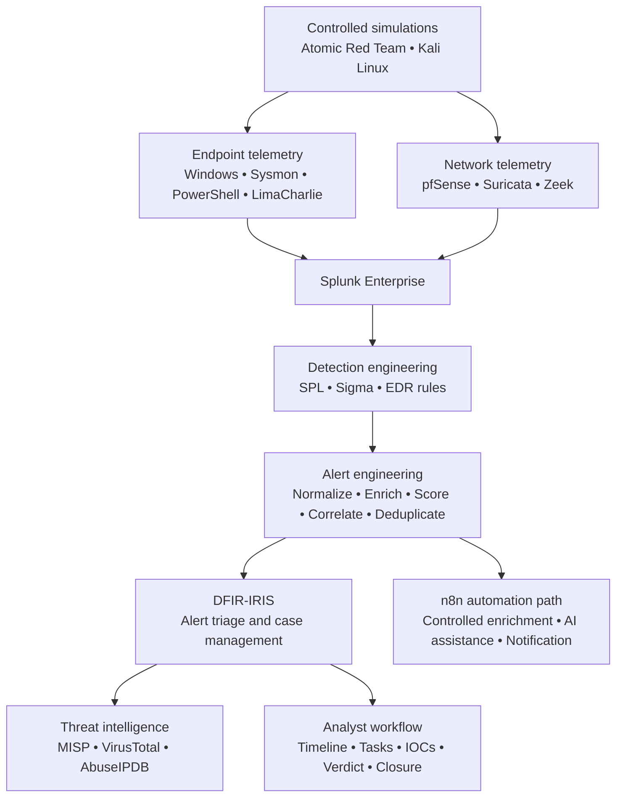
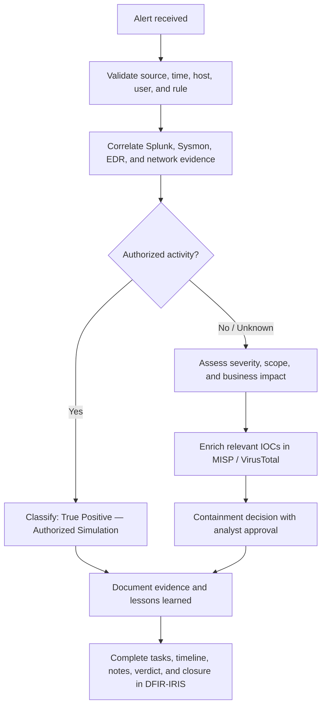

<div align="center">


<p>
  
  
  
</p>

<p>
  
  
  
  
  
</p>

<p>
  
  
  
  
  
</p>

### An engineering-focused blue-team lab connecting telemetry, detection, enrichment, case management, and investigation evidence

[Architecture](#architecture) ·
[Detection Pipeline](#detection-to-response-pipeline) ·
[Validated Scenarios](#validated-attack-scenarios) ·
[Case Workflow](#incident-response-workflow) ·
[Roadmap](#engineering-roadmap)

</div>

---

## Executive Summary

**SuperSOC / SuperSOAR HomeLab** is a VMware-based security operations lab built to practice the full detection-to-response lifecycle:

1. collect endpoint, firewall, IDS/IPS, network, and EDR telemetry;
2. centralize and investigate events in Splunk Enterprise;
3. build SPL- and Sigma-aligned detections;
4. normalize fields, add asset context, score risk, correlate related events, and reduce duplicate alerts;
5. enrich indicators with threat-intelligence sources;
6. create and manage alerts and cases in DFIR-IRIS;
7. validate coverage with Atomic Red Team and controlled Kali Linux simulations;
8. document the timeline, evidence, verdict, response decision, and lessons learned.

This project is not presented as a production SOC or a fully autonomous response platform. It is a controlled home lab that demonstrates practical SOC analysis, detection engineering, security automation, threat validation, and incident documentation.

### What this project demonstrates

| Capability | Practical implementation |
|---|---|
| Centralized monitoring | Splunk Enterprise receives Windows, Sysmon, PowerShell, pfSense, Suricata, Zeek, and LimaCharlie telemetry |
| Endpoint visibility | Sysmon, Windows Event Logs, PowerShell logging, Splunk Universal Forwarder, and LimaCharlie EDR |
| Network visibility | pfSense firewall logs, Suricata alerts, and Zeek network metadata |
| Detection engineering | SPL correlation searches, EDR detection rules, Sigma rules, allowlists, and ATT&CK mapping |
| Alert engineering | Field normalization, asset enrichment, severity/risk scoring, time-window correlation, and deduplication |
| Security orchestration | n8n workflows for controlled enrichment, AI-assisted analysis, and notification |
| Incident response | DFIR-IRIS alert triage, case creation, assignment, tasks, timeline analysis, IOC handling, notes, and closure |
| Threat intelligence | MISP, VirusTotal, and AbuseIPDB enrichment where an investigation contains relevant observables |
| Adversary emulation | Atomic Red Team and controlled Kali Linux activity mapped to MITRE ATT&CK |
| Analyst reporting | Reproducible investigation reports with process chains, screenshots, query evidence, impact, and verdict |

---

## Architecture

### Network segmentation status

The repository distinguishes between the **current lab deployment** and the **target segmented architecture**. This keeps the design recruiter-friendly without claiming that an unimplemented security control is already operational.

| Area | Current lab deployment | Target hardening design |
|---|---|---|
| SOC services | VMnet2 — `172.16.1.0/24` | VMnet2 — `172.16.1.0/24` |
| Windows 10 victim | `172.16.1.10` on the shared VMnet2 lab segment | VMnet4 — `172.16.10.10` on a dedicated endpoint/LAN segment |
| LAN gateway | Shared pfSense interface `172.16.1.1` | Dedicated pfSense VMnet4 interface `172.16.10.1` |
| Isolation model | Home-lab resource constraint; services share one internal virtual segment | Inter-zone filtering, least privilege, and default-deny policy between LAN, SOC, DMZ, and WAN |
| Diagram below | Represents the target security architecture | Planned segmentation/hardening milestone |

> [!IMPORTANT]
> The VMnet4 endpoint network (`172.16.10.0/24`) shown below is a **target architecture**, not evidence that VMnet4 is already deployed. The current Windows 10 victim remains at `172.16.1.10` until the migration and firewall rules are implemented and validated.

### Target segmented architecture

<p align="center">
  
</p>

<p align="center"><em>Target design: SOC services on VMnet2, DMZ on VMnet3, victim endpoint on planned VMnet4, and controlled attack traffic from the VMware NAT/WAN segment.</em></p>

### Current lab inventory

| Zone | Component | Address | Primary role |
|---|---|---:|---|
| SOC / VMnet2 | pfSense internal gateway | `172.16.1.1` | Routing, firewall policy, NAT, IDS/IPS integration |
| SOC / VMnet2 | Windows 10 victim | `172.16.1.10` | Endpoint telemetry and controlled attack simulation target |
| SOC / VMnet2 | Splunk Enterprise | `172.16.1.20` | SIEM, search, dashboards, correlation, and alerting |
| SOC / VMnet2 | n8n | `172.16.1.30` | Enrichment, workflow orchestration, and notifications |
| SOC / VMnet2 | Zeek NSM | `172.16.1.40` | Network metadata and protocol visibility |
| SOC / VMnet2 | DFIR-IRIS | `172.16.1.50` | Alert triage, case management, tasks, and investigation timeline |
| SOC / VMnet2 | MISP | `172.16.1.60` | Threat-intelligence and IOC context |
| DMZ / VMnet3 | Windows Server 2012 R2 | `10.0.0.20` | MDaemon mail, DNS, and IIS lab services |
| WAN / VMware NAT | Kali Linux | `192.168.168.154` | Authorized adversary emulation |

### Target firewall policy

The planned VMnet4 migration is intended to enforce the following policy:

| Source | Destination | Service | Policy | Purpose |
|---|---|---|---|---|
| Endpoint LAN | Splunk | TCP `9997` | Allow | Splunk Universal Forwarder telemetry |
| Endpoint LAN | LimaCharlie cloud | HTTPS `443` | Allow | EDR sensor communication |
| Endpoint LAN | SOC services | Any other | Deny by default | Limit endpoint-to-management-plane access |
| SOC admin hosts | Endpoint LAN | Required management ports only | Restricted allow | Investigation and approved administration |
| DMZ | SOC collectors | Configured log-ingestion ports | Restricted allow | Centralized logging without broad DMZ access |
| WAN / attacker zone | Internal zones | Explicit test services only | Deny by default | Keep simulations scoped and reproducible |

---

## Detection-to-Response Pipeline



### Pipeline stages

| Stage | Engineering focus | Output |
|---|---|---|
| 1. Collection | Forward selected endpoint and network telemetry while controlling noise | Searchable events in Splunk |
| 2. Normalization | Map inconsistent source fields into common host, user, process, network, rule, and severity fields | Stable detection schema |
| 3. Context | Add asset role, criticality, owner, zone, and allowlist context where available | Analyst-ready event context |
| 4. Detection | Apply SPL, Sigma-aligned logic, EDR rules, thresholds, and behavioral patterns | Candidate security events |
| 5. Correlation | Group related activity by host, rule, process chain, and time window | One activity chain instead of isolated micro-alerts |
| 6. Risk scoring | Combine source severity, rule confidence, asset value, and behavior | Prioritized alert |
| 7. Deduplication | Suppress repeated events and preserve representative evidence | Reduced alert fatigue |
| 8. Case creation | Send a normalized payload to DFIR-IRIS | Triage-ready alert or case |
| 9. Enrichment | Query MISP, VirusTotal, or AbuseIPDB only when relevant observables exist | IOC reputation and context |
| 10. Investigation | Build timeline, process tree, impact assessment, and response decision | Documented incident verdict |

### Operational timing

The current design intentionally separates **telemetry latency** from **consolidated alert latency**:

| Measurement | Expected behavior |
|---|---|
| Raw telemetry | Ingested near real time, subject to source and forwarder configuration |
| Scheduled detection | Runs according to the saved-search schedule |
| Correlation window | May wait several minutes to collect the complete activity chain |
| DFIR-IRIS alert | Created after normalization, scoring, and deduplication complete |

This means the project does not use an unsupported “everything responds in under 60 seconds” claim. A short delay can be an intentional engineering trade-off when it converts multiple low-context events into one higher-quality investigation unit.

---

## Telemetry and Data Sources

| Source | Key events or data | Detection value |
|---|---|---|
| Windows Security | Authentication, privilege use, account changes, scheduled tasks, service installation, log clearing | Identity activity, persistence, and privilege escalation |
| Sysmon | Process creation, network connection, image load, process access, file, registry, DNS, process tampering | Process-chain and endpoint investigation |
| PowerShell Operational | Event IDs `4103` and `4104` | Script content, suspicious commands, and encoded execution |
| LimaCharlie EDR | Detections, process/network telemetry, sensor context | High-confidence endpoint behavior and cross-source validation |
| pfSense | Filter actions, source/destination, ports, and interfaces | Scanning, blocked traffic, and perimeter activity |
| Suricata | IDS/IPS signature alerts | Network threat detection and signature context |
| Zeek | Connection and protocol metadata | Network forensics and behavioral context |
| MISP | IOC attributes, tags, events, and related intelligence | Threat-context enrichment |

Representative Splunk indexes used across the lab documentation include:

```text
win10eventlog   win10sysmon   win10powershell
edr             pfsense       suricata         zeek
```

---

## Detection Engineering

### Detection principles

- Prefer behavior and process-chain context over a single filename match.
- Keep raw evidence available for analyst verification.
- Separate detection confidence from business impact.
- Treat authorized simulations as **True Positive — Authorized Simulation**, not as false positives.
- Use allowlists narrowly and document why an exception exists.
- Map detections to ATT&CK only when the available telemetry supports the mapping.
- Correlate events before creating cases when a single test produces many related alerts.
- Require human approval for disruptive response actions.

### Example: UC-001 PowerShell EncodedCommand

The repository includes a Sigma rule that detects PowerShell or PowerShell Core using full or shortened `EncodedCommand` switches.

[View the Sigma rule](MITRE-ATTACK-Practice/Ransomware-Simulation/Sigma_Rule/T1059.001.yaml)

```yaml
title: UC-001 PowerShell EncodedCommand
status: test
logsource:
  product: windows
  category: process_creation
detection:
  selection_image:
    Image|endswith:
      - '\powershell.exe'
      - '\pwsh.exe'
  selection_encoded_switch:
    CommandLine|re: '(?i)(^|\s)-(e|ec|en|enc|enco|encod|encode|encoded|encodedc|encodedco|encodedcom|encodedcomm|encodedcomma|encodedcomman|encodedcommand)(\s+|:|=)'
  condition: selection_image and selection_encoded_switch
level: medium
```

The rule includes legitimate automation, deployment tooling, and authorized security validation in its false-positive considerations. This is important because an encoded command is suspicious context, not automatic proof of compromise.

### Alert-quality engineering

The current project evolution focuses on improving the analyst experience:

- normalize fields from Splunk, Sysmon, and LimaCharlie into one alert schema;
- enrich alerts with asset metadata from a controlled lookup;
- calculate risk from detection severity, confidence, and asset context;
- group related detections within a defined time window;
- avoid creating six to eight separate IRIS alerts for one Atomic Red Team activity chain;
- preserve the representative raw event and correlation metadata;
- generate a consistent DFIR-IRIS payload for repeatable triage.

---

## Validated Attack Scenarios

All listed activity was executed in an isolated, authorized lab for defensive validation.

| Phase | Scenario | ATT&CK mapping | Primary evidence | Outcome |
|---|---|---|---|---|
| Execution | PowerShell download cradle and credential-dumping simulation | [T1059.001](https://attack.mitre.org/techniques/T1059/001/), T1105, T1003 | Sysmon process/DNS/network events, LimaCharlie detections, Splunk timeline | True Positive — Authorized Simulation |
| Execution | PowerShell `-e` / EncodedCommand | [T1059.001](https://attack.mitre.org/techniques/T1059/001/) | Sysmon Event ID 1, EDR cross-check, IRIS alert | True Positive — Authorized Simulation |
| Execution | Command shell writes and executes VBScript | [T1059.003](https://attack.mitre.org/techniques/T1059/003/), T1059.005, T1033 | `cmd.exe → wscript.exe → whoami.exe` chain | True Positive — Authorized Simulation |
| Privilege Escalation | Event Viewer UAC bypass simulation | [T1548.002](https://attack.mitre.org/techniques/T1548/002/) | Registry modification, PowerShell, Event Viewer/MMC, child process evidence | True Positive — Authorized Simulation |
| Defense Evasion | Microsoft Defender tampering attempt | [T1562.001](https://attack.mitre.org/techniques/T1562/001/) | `Set-MpPreference`, Sysmon, LimaCharlie, Splunk, IRIS | Attempt detected; requested changes were blocked |
| Discovery | Host, user, process, and file-system discovery | T1082, T1033, T1057, T1083 | `hostname.exe`, `whoami.exe`, process and file events | Correlated as supporting context |
| Network | Repeated blocked traffic / scanning | T1595.001 | pfSense, Suricata, source-IP aggregation | Detection and enrichment workflow validated |
| Endpoint | LOLBin execution | T1218, T1105 where supported | Process creation, command line, hash, network context | Detection and enrichment workflow validated |

> [!NOTE]
> The existing Defender-tampering report filename contains the historical lab label `T1685-19`. The behavior is presented here under the current ATT&CK concept **Impair Defenses: Disable or Modify Tools (T1562.001)** while retaining the original report filename for repository compatibility.

### Investigation reports

- [PowerShell credential-dumping simulation](MITRE-ATTACK-Practice/Ransomware-Simulation/phase-1-execution/T1059.001-PowerShell.md)
- [PowerShell EncodedCommand — Atomic Test #17](MITRE-ATTACK-Practice/Ransomware-Simulation/phase-1-execution/T1059.001-17PowerShell_Command_Execution.md)
- [Windows Command Shell — Atomic Test #6](MITRE-ATTACK-Practice/Ransomware-Simulation/phase-1-execution/T1059.003-Windows-Command-Shell-Test6.md)
- [Bypass UAC using Event Viewer](MITRE-ATTACK-Practice/Ransomware-Simulation/phase-2-privilege-escalation/T1548.002-2_Bypass_UAC_using_Event_Viewer_%28PowerShell%29.md)
- [Microsoft Defender tampering attempt](MITRE-ATTACK-Practice/Ransomware-Simulation/phase-3-defense-evasion/T1685-19_Tamper_with_Windows_Defender_ATP_PowerShell.md)
- [MITRE ATT&CK practice index](MITRE-ATTACK-Practice/README.md)

---

## Incident Response Workflow



### Analyst checklist

1. Confirm the detection source, rule, host, user, and time window.
2. Review the raw event before trusting the alert summary.
3. Reconstruct the parent-child process chain.
4. Correlate EDR telemetry with Sysmon, PowerShell, and network data.
5. Identify files, hashes, domains, IP addresses, registry keys, and commands.
6. Enrich only observables relevant to the case.
7. Separate attempted behavior from successful impact.
8. Assign a verdict, confidence, severity, and response decision.
9. Record screenshots, SPL queries, timeline entries, IOCs, and analyst notes.
10. Close the case only after the evidence supports the final classification.

### Standard case outcome fields

| Field | Example values |
|---|---|
| Classification | True Positive, Benign Positive, False Positive |
| Context | Authorized Simulation, Administrative Activity, Unknown |
| Confidence | Low, Medium, High |
| Severity | Informational, Low, Medium, High, Critical |
| Impact | None, Attempted, Confirmed |
| Containment | Not required, Recommended, Required |
| Escalation | Not required, Tier 2, Incident Response |
| Final status | Open, Monitoring, Closed after validation |

---

## Automation Paths

### Current IRIS-centered path

```text
Telemetry
  → Splunk detection/correlation
  → normalization + asset context + risk scoring
  → deduplication
  → DFIR-IRIS alert
  → analyst triage / merge / case tasks / timeline
  → MISP or VirusTotal enrichment when applicable
  → verdict and closure
```

### n8n enrichment and notification path

```text
Splunk alert
  → n8n webhook
  → route by alert type
  → AbuseIPDB / VirusTotal enrichment
  → optional AI-assisted summary using sanitized lab data
  → Telegram notification
```

The n8n path demonstrates orchestration and analyst-assistance concepts. AI output is treated as supporting context, not as the authoritative verdict, and no destructive containment action is executed without human approval.

---

## Technology Stack

| Layer | Technologies |
|---|---|
| Virtualization | VMware Workstation |
| Network security | pfSense, Suricata, syslog-ng |
| Network monitoring | Zeek |
| SIEM | Splunk Enterprise, Splunk Universal Forwarder |
| Endpoint telemetry | Windows Event Logs, Sysmon, PowerShell Script Block Logging |
| EDR | LimaCharlie |
| Detection content | SPL, Sigma, custom EDR rules, MITRE ATT&CK |
| SOAR / automation | n8n, webhooks, REST APIs, controlled scripting |
| Case management | DFIR-IRIS |
| Threat intelligence | MISP, VirusTotal, AbuseIPDB |
| Validation | Atomic Red Team, Kali Linux |
| Notification / assistance | Telegram Bot, optional Google Gemini lab workflow |
| Infrastructure | Ubuntu Server, Windows 10, Windows Server 2012 R2, Cloudflare Tunnel |

---

## Repository Map

```text
SOAR_HomeLab/
├── README.md
├── SuperSOAR_homelab/
│   ├── SuperSOAR_HomeLab.md
│   └── SuperSOAR_HomeLab_images/
└── MITRE-ATTACK-Practice/
    ├── README.md
    └── Ransomware-Simulation/
        ├── Sigma_Rule/
        ├── phase-1-execution/
        ├── phase-2-privilege-escalation/
        └── phase-3-defense-evasion/
```

- [Detailed SuperSOAR build report](SuperSOAR_homelab/SuperSOAR_HomeLab.md)
- [MITRE ATT&CK validation workspace](MITRE-ATTACK-Practice/README.md)
- [PowerShell Sigma detection](MITRE-ATTACK-Practice/Ransomware-Simulation/Sigma_Rule/T1059.001.yaml)

---

## Engineering Decisions and Lessons Learned

### 1. One activity chain should not become eight disconnected alerts

Atomic tests often create short bursts of related detections. Grouping by endpoint, rule family, process chain, and time window gives the analyst a more useful unit of investigation.

### 2. Fast is not always the same as useful

Raw telemetry should arrive quickly, but a consolidated alert may intentionally wait for a correlation window. The project measures ingestion and alert creation separately.

### 3. Detection is not proof of impact

The Defender-tampering test produced valid security detections, but Windows rejected the requested configuration changes. The correct conclusion is **attempt detected and blocked**, not “Defender was disabled.”

### 4. Threat intelligence is contextual

An IP reputation score or hash verdict supports an investigation; it does not replace process, user, host, network, and timeline analysis.

### 5. Segmentation must be implemented, not only drawn

Moving the victim endpoint to VMnet4 is tracked as a hardening milestone. The documentation will be promoted from “target” to “implemented” only after interface configuration, routing, firewall rules, telemetry flow, and attack-path tests are verified.

---

## Engineering Roadmap

| Status | Milestone |
|---|---|
| ✅ Implemented | Splunk SIEM with endpoint and network telemetry |
| ✅ Implemented | Sysmon, PowerShell logging, and LimaCharlie EDR visibility |
| ✅ Implemented | pfSense, Suricata, and Zeek monitoring |
| ✅ Implemented | n8n enrichment and notification workflow |
| ✅ Implemented | DFIR-IRIS case-management workflow |
| ✅ Implemented | MISP / VirusTotal / AbuseIPDB enrichment paths |
| ✅ Implemented | Atomic Red Team investigation reports and ATT&CK mapping |
| ✅ Implemented | Sigma rule for PowerShell EncodedCommand |
| 🔧 In progress | Higher-quality alert normalization, risk scoring, correlation, and deduplication |
| 🔧 In progress | Expanded Suricata blocked-scanner correlation and noise reduction |
| 🧭 Planned | Move Windows 10 victim to VMnet4 `172.16.10.0/24` |
| 🧭 Planned | Validate default-deny inter-zone firewall policy |
| 🧭 Planned | Enforce verified TLS for every internal API integration |
| 🧭 Planned | Centralize secrets and remove credentials from workflow definitions |
| 🧭 Planned | Add approval-gated containment playbooks |
| 🧭 Planned | Add detection-as-code testing and CI validation |
| 🧭 Planned | Expand ATT&CK coverage across persistence, credential access, discovery, lateral movement, and impact |

---

## Security and Responsible Use

- All attack simulations are executed only in an isolated, authorized home-lab environment.
- No production credentials, customer information, or confidential organizational telemetry is included.
- API tokens, webhook secrets, tunnel credentials, and passwords must never be committed.
- AI-assisted analysis receives only controlled or sanitized lab data.
- Automated containment remains human-approved to reduce the risk of unsafe actions.
- Windows Server 2012 R2 is used only as a deliberately legacy lab workload and must not be exposed as a production service.
- The project is intended for defensive education, detection validation, and incident-response practice.

---

## Author

<div align="center">

### Nguyen Thanh Long

**Information Assurance Student · SOC Analyst Intern Candidate · Blue Team HomeLab Builder**

[](https://github.com/longnt05-afk)


<br/>

<em>Built to turn raw security telemetry into defensible detections, reproducible investigations, and documented response decisions.</em>

<br/><br/>

**If this lab helps your SOC learning journey, consider giving the repository a star.**

</div>


