**SOAR HomeLab**
**Xây Dựng Hệ Thống SIEM + SOAR Tự Động Hóa Ứng Phó Sự Cố Với Tích Hợp AI**
Báo cáo này là phần mở rộng nâng cao của bài lab pfSense trước đó, bổ sung các tầng phòng thủ SIEM, SOAR, Threat Intelligence và AI-Powered Analysis vào hệ thống mạng doanh nghiệp 3 vùng đã triển khai.
**MỤC LỤC**
Tổng Quan Dự Án
Kiến Trúc Hệ Thống
Triển Khai SIEM - Splunk Enterprise
Triển Khai Endpoint Monitoring - Sysmon
Triển Khai SOAR - n8n Automation
Chi Tiết 3 Nhánh Xử Lý SOAR
Kết Luận

**1. TỔNG QUAN DỰ ÁN**
**1.1 Bối Cảnh & Động Lực**
Trong bài lab pfSense trước đó, hệ thống mạng doanh nghiệp 3 vùng (WAN/LAN/DMZ) đã được triển khai thành công với tường lửa pfSense làm trung tâm. Tuy nhiên, qua các test case tấn công với Kali Linux, một hạn chế nghiêm trọng đã được nhận diện:
1. Firewall chỉ lọc Layer 3-4 (IP/Port) → KHÔNG phát hiện
được tấn công Layer 7 đi qua port hợp lệ
2. KHÔNG có hệ thống SIEM
3. KHÔNG có cơ chế ứng phó tự động khi phát hiện sự cố
4. KHÔNG có khả năng giám sát endpoint
5. Admin phải kiểm tra log thủ công → chậm, dễ bỏ sót
Bài lab SuperSOAR HomeLab này giải quyết **toàn bộ 5 hạn chế** trên bằng cách bổ sung các tầng phòng thủ mới:
- SIEM
- Endpoint – Sysmon
- SOAR – n8n
- Threat Intel – AbuseIPDB, VirusTotal
- AI Analyst – Gemini
- Alert Channel – Telegram Bot
**1.2 Mục Tiêu Dự Án**
|  | Mục tiêu | Mô tả |
| --- | --- | --- |
| 1 | Triển khai SIEM | Thu thập, lưu trữ và phân tích log tập trung từ firewall và endpoint |
| 2 | Giám sát endpoint | Theo dõi tiến trình, kết nối mạng, thay đổi hệ thống trên máy trạm |
| 3 | Tự động hóa ứng phó | Khi phát hiện mối đe dọa → tự động phân tích → thông báo real-time |
| 4 | Tích hợp Threat Intelligence | Tra cứu tự động IP, phân tích mã Hash file nghi ngờ |
| 5 | AI-Powered Analysis | Sử dụng AI phân tích ngữ cảnh và viết báo cáo bảo mật tự động |
| 6 | Thông báo real-time | Gửi cảnh báo bảo mật đến team SOC qua Telegram tức thì |

**1.3 Phạm Vi Dự Án**
Dự án tập trung vào 3 kịch bản ứng phó sự cố đại diện cho 3 nhóm mối đe dọa phổ biến nhất.
**3 USE CASES CHÍNH   **
CASE 1: Network Threat Detection
- Nguồn log: pfSense Firewall
- Phát hiện: IP bị tường lửa chặn > 50 lần
- Enrichment: AbuseIPDB (Threat Intelligence)
- AI: Google Gemini (Phân tích rủi ro + Gán nhãn)
- Output: Cảnh báo Telegram với nhãn 🔴🟡🟢

CASE 2: Endpoint Threat Detection
- Nguồn log: Sysmon (Event ID 1 - Process Creation)
- Phát hiện: Tiến trình nghi ngờ (certutil, rundll32, bitsadmin)
- Enrichment: VirusTotal (File Hash Analysis)
- AI: Google Gemini (Phân tích kết hợp VT + Sysmon)
- Output: Cảnh báo Telegram với nhãn 🔴🟡🟢

CASE 3: PowerShell Threat Detection
- Nguồn log: PowerShell Operational (Event ID 4104)
- Phát hiện: PowerShell mã hóa Base64, Invoke-Expression, IEX
- Enrichment: Không (AI trực tiếp giải mã Base64)
- AI: Google Gemini (Giải mã + Phân tích nội dung script)
- Output: Cảnh báo Telegram với nhãn 🔴🟡🟢

**2. KIẾN TRÚC HỆ THỐNG**
**2.1 Sơ Đồ Kiến Trúc Tổng Quan**
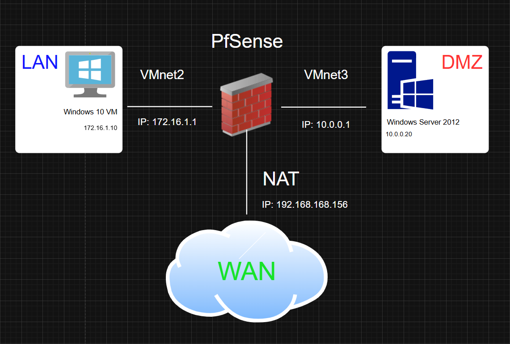
Hệ thống SOAR HomeLab được trien khai tren VMware Workstation, mô phỏng mạng doanh nghiệp 3 vùng tách biệt. Mỗi vùng mạng được phân tách bằng pfSense đóng vai trò tường lửa trung tâm, đảm bảo nguyên tắc Defense-in-Depth.

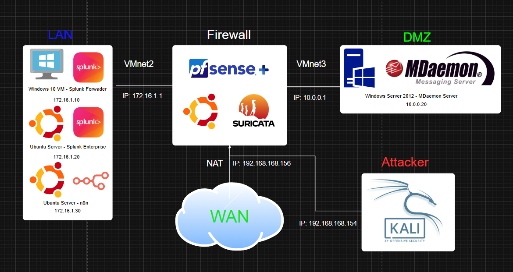

**2.2 Luồng Dữ Liệu (Data Flow)**
Log từ pfSense và Windows 10 được đẩy về Splunk. Khi Splunk phát hiện bất thường, alert được gửi qua Webhook đến n8n. n8n tự động tra cứu AbuseIPDB/VirusTotal, gửi kết quả cho Gemini phân tích, rồi gửi cảnh báo về Telegram.
| Bước | Từ | Đến | Giao Thức / Cổng | Mô Tả |
| --- | --- | --- | --- | --- |
| 1 | pfSense + Suricata | Splunk (172.16.1.20) | Syslog UDP / 5514 | Gửi firewall filterlog và Suricata alerts |
| 2 | Windows 10 (SUF) | Splunk (172.16.1.20) | TCP / 9997 | Gửi Sysmon Event ID 1, PowerShell Event ID 4104 |
| 3 | Splunk Alert | n8n (172.16.1.30) | HTTP Webhook / 5678 | Kích hoạt workflow khi phát hiện ngưỡng bất thường |
| 4 | n8n | AbuseIPDB / VirusTotal | HTTPS API / 443 | Tra cứu Threat Intelligence tự động |
| 5 | n8n | Google Gemini API | HTTPS API / 443 | Gửi dữ liệu cho AI phân tích và gán nhãn nguy hiểm |
| 6 | n8n | Telegram Bot | HTTPS API / 443 | Gửi cảnh báo cuối cùng đến SOC Analyst |

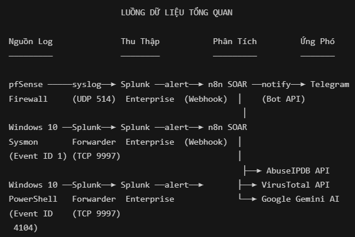

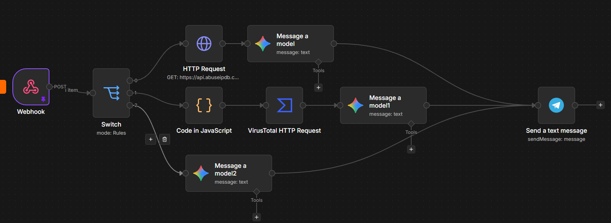

**3****. TRIỂN KHAI SIEM - SPLUNK ENTERPRISE**
**3****.1 Cấu hình IP tĩnh cho Ubuntu ****Server**
Chuyển card mạng sang VM net2
**sudo nano /etc/netplan/50-cloud-init.yaml **để đổi lại địa chỉ ipv4 và đổi sang card mạng ens33 thay vì eth0 (NAT)

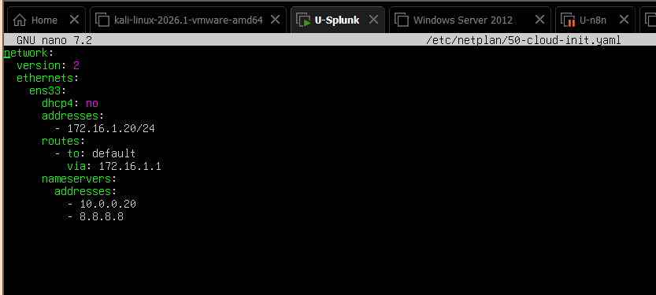

**sudo netplan generate**
**sudo netplan apply**
**ip a** để check xem card đã nhận địa chỉ đã cấu hình

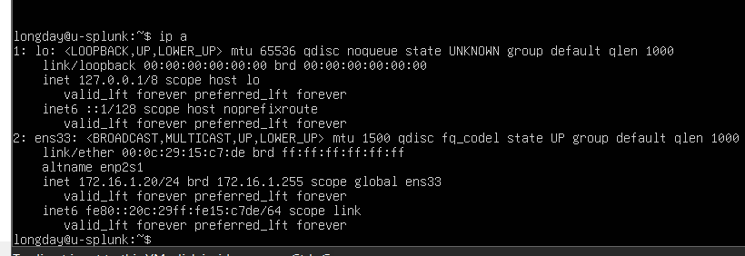

Ping từ firewall pfsense sang splunk đã thông

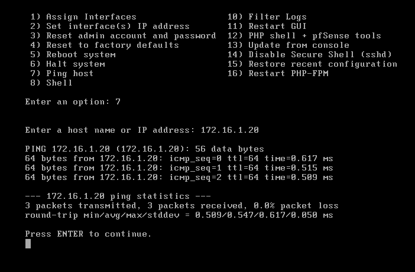

Đã có thể ping tới firewall và có thể đi ra ngoài WAN

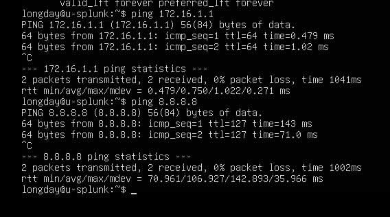

**3****.2 Cài Splunk Enterprise **
**wget -O splunk-10.4.0-f798d4d49089-linux-amd64.deb **
**sudo dpkg -i ****splunk-10.4.0-f798d4d49089-linux-amd64.deb**
Khởi động Splunk lần đầu (chấp nhận license + tạo admin)
**sudo /opt/splunk/bin/splunk start --accept-license**
Bật Splunk khởi động cùng hệ thống
**sudo /opt/splunk/bin/splunk enable boot-start**
Cấu hình lắng nghe log từ Forwarder (Port 9997)

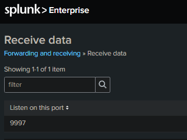

Port 514 bị chiếm bởi rsyslog (dịch vụ syslog mặc định của Ubuntu) và cũng là port đặc quyền (< 1024) nên user splunk không bind được.
Cấu hình nhận log từ firewall pfsense do cổng 514 đã bị chiếm nên dùng cổng 5514

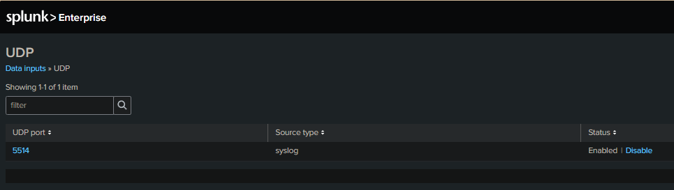

Tạo thêm 3 index để nhận 3 nguồn log từ Windows event, sysmon và một ít từ powershell

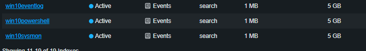

Cho phép truy cập Splunk Web UI bằng mở port 8000

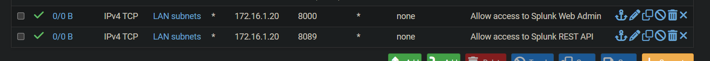

Cấu hình gửi pfSense syslog bằng cổng 5514
Vào Status → System Logs → Settings
Kéo xuống phần Remote Logging Options
Check Enable Remote Logging
Remote log servers: 172.16.1.20:5514

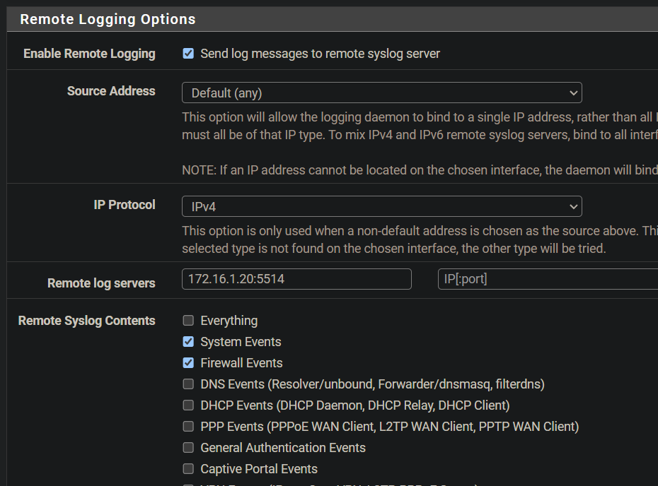

**Cấu**** hình gửi log ****Suricata Alerts → Splunk**
Vào Services → Suricata → Logs Mgmt
Cấu hình gửi alerts qua syslog đến 172.16.1.20:5514
Khi bật tùy chọn này, cảnh báo của Suricata mới được đưa vào hệ thống log chung và từ đó pfSense sẽ tự động đẩy sang Splunk theo cấu hình ở bước trước

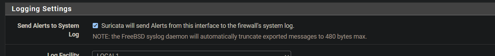

Test trên Splunk Web UI
Tìm kiếm: index=* sourcetype=syslog
log từ pfSense hiển thị

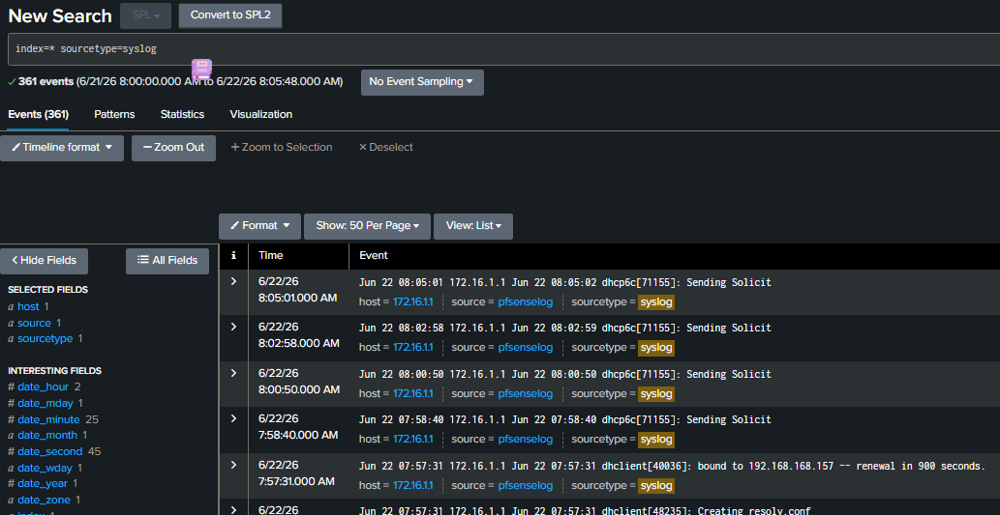

**3****.3 Cài Đặt Splunk Universal Forwarder (Windows 10 - 172.16.1.10)**
inputs.conf khai báo nguồn log cần thu thập (Windows Event, Sysmon, PowerShell). outputs.conf chỉ định địa chỉ Splunk Indexer nhận log.
Cấu Hình inputs.conf
File cấu hình chính: C:\Program Files\SplunkUniversalForwarder\etc\system\local\inputs.conf
**WINDOWS SECURITY LOG → index=win10eventlog**
| Nhóm | Event ID | Ý Nghĩa |
| --- | --- | --- |
| Authentication | 4624, 4625 | Login thành công / thất bại → detect brute force |
| Logoff | 4634, 4647 | Session kết thúc → track thời gian hoạt động |
| Explicit Credential | 4648 | Dùng credential khác khi đang login → lateral movement |
| Privilege Use | 4672, 4673 | Admin login / dùng quyền đặc biệt → privilege escalation |
| Process | 4688, 4689 | Process tạo/kết thúc (cần bật audit) → redundant với Sysmon |
| Service Install | 4697 | Cài service mới → malware persistence |
| Scheduled Task | 4698, 4702 | Tạo/sửa scheduled task → persistence |
| Policy Change | 4719 | Thay đổi audit policy → attacker che dấu vết |
| Account Mgmt | 4720→4756 | Tạo/xóa/lock account, thêm vào group → privilege escalation |
| Log Cleared | 1102 | Xóa Security log → dấu hiệu attacker xóa dấu vết |

**WINDOWS SYSTEM LOG → index=win10eventlog**
| Event ID | Ý Nghĩa |
| --- | --- |
| 7045 | Service mới được cài → kỹ thuật persistence phổ biến nhất của malware |
| 7040 | Thay đổi start type của service → attacker enable service bị disable |
| 7036 | Service start/stop → theo dõi trạng thái service |
| 1074 | Shutdown/Restart có chủ ý → ai ra lệnh restart |
| 6008 | Unexpected shutdown → crash hoặc bị force kill |
| 6005, 6006 | Event Log service start/stop → giám sát uptime |

**APPLICATION LOG → Tắt **
Application log chủ yếu là lỗi của phần mềm thông thường (Office, browser crash...), tỷ lệ signal/noise cực thấp trong bối cảnh bảo mật.
**SYSMON LOG → index=win10sysmon**
| Event ID | Tên | Dùng Để Detect |
| --- | --- | --- |
| 1 | ProcessCreate | LOLBin, malware execution — trigger Alert 2 của bạn |
| 3 | NetworkConnect | C2 callback, lateral movement |
| 5 | ProcessTerminate | Malware tự xóa sau khi chạy |
| 6 | DriverLoad | Rootkit, kernel-level malware |
| 7 | ImageLoad | DLL injection, DLL hijacking |
| 8 | CreateRemoteThread | Process injection — kỹ thuật của Mimikatz, Cobalt Strike |
| 10 | ProcessAccess | LSASS dumping — credential theft |
| 11 | FileCreate | Malware drop file, ransomware tạo file |
| 12, 13, 14 | RegistryEvent | Registry persistence, run key modification |
| 15 | FileCreateStreamHash | Alternate Data Stream — kỹ thuật ẩn file |
| 22 | DNSQuery | C2 domain lookup, DNS tunneling |
| 23 | FileDelete | Malware xóa dấu vết |
| 25 | ProcessTamper | Process hollowing, process doppelgänging |

**POWERSHELL LOG → index=win10powershell**
| Event ID | Tên | Ý Nghĩa |
| --- | --- | --- |
| 4104 | ScriptBlock Logging | Quan trọng nhất ghi toàn bộ script đã decode, trigger Alert 3 |
| 4103 | Module Logging | Ghi từng lệnh PowerShell theo module, bổ sung ngữ cảnh cho 4104 |

**Tổng ****Kết:**** Những Gì Splunk Forwarder Sẽ Đẩy Lên**
win10eventlog  ← Security (17 Event ID) + System (7 Event ID)
win10sysmon    ← Sysmon (15 loại event, đã lọc bởi SwiftOnSecurity config)
win10powershell← PowerShell Operational (Event ID 4103, 4104)
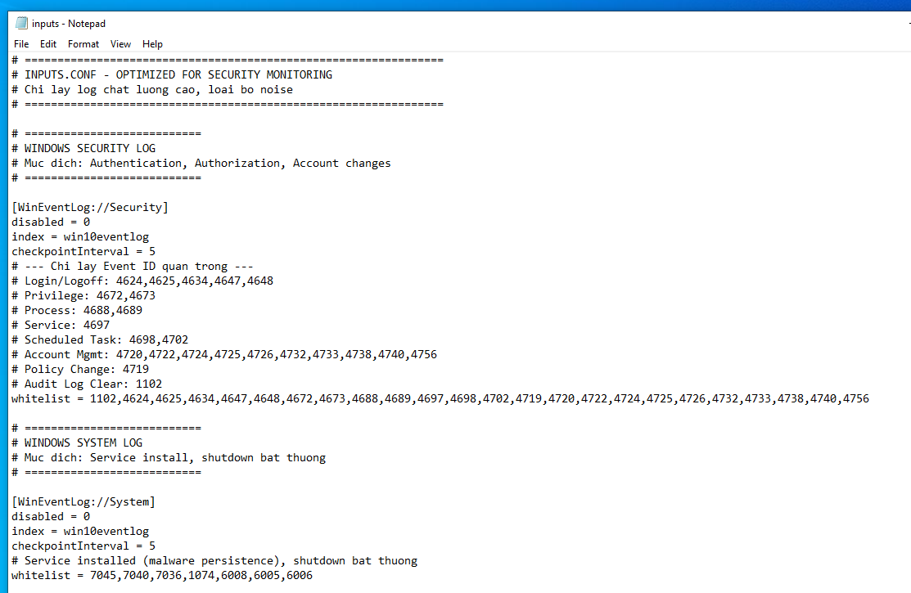

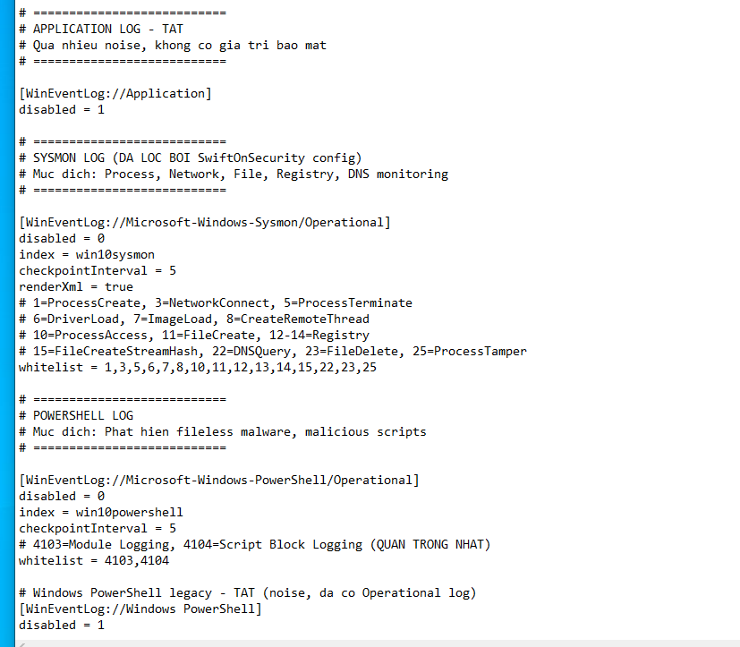
Cấu Hình outputs.conf
File: C:\Program Files\SplunkUniversalForwarder\etc\system\local\outputs.conf

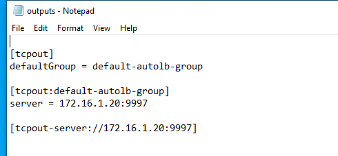

Test trên web Splunk xem đã có log đẩy lên đủ cho 3 index

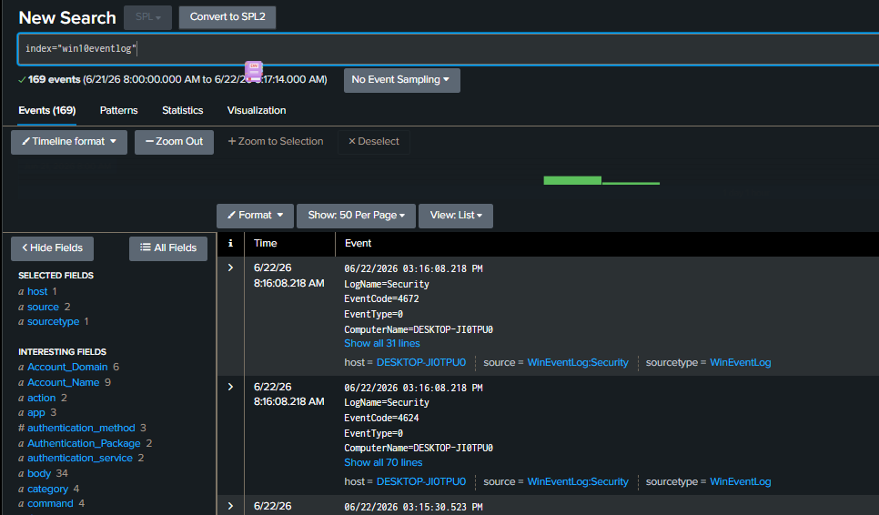

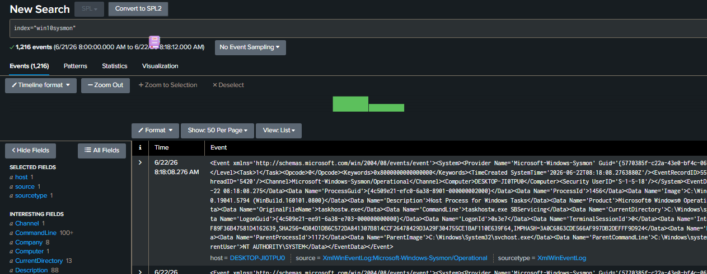

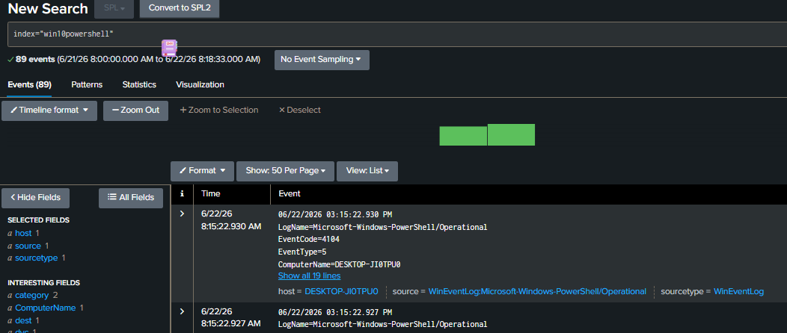

**3****.5 Tạo 3 Saved Alerts Trên Splunk**
Alert 1: SOAR - Blocked IP > 50 times

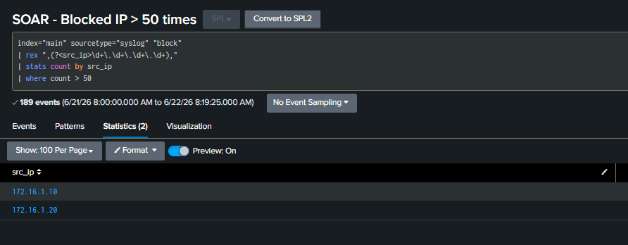

Alert này giám sát log tường lửa pfSense. Khi phát hiện một địa chỉ IP bị chặn hơn 50 lần trong 1 phút gần nhất (dấu hiệu rà quét cổng hoặc tấn công brute force), Splunk tự động gửi thông tin IP đó sang n8n qua Webhook để xử lý tiếp.
Alert 2: SOAR - Suspicious Sysmon Process

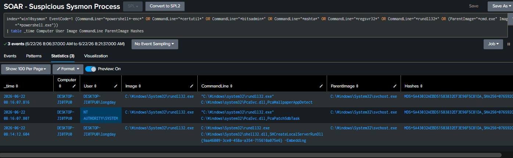

Alert này giám sát tiến trình trên máy Windows 10 thông qua Sysmon Event ID 1 (Process Creation). Nó phát hiện các tiến trình thường bị attacker lạm dụng theo kỹ thuật Living off the Land Binaries
Living off the Land Binaries là kỹ thuật mà kẻ tấn công lạm dụng các chương trình hợp pháp đã có sẵn trên hệ điều hành để thực hiện hành vi tấn công thay vì tải và chạy mã độc riêng.
Ví dụ
Trên Windows, hacker có thể dùng:
PowerShell → tải và chạy mã từ Internet.
certutil.exe → tải file từ máy chủ khác.
mshta.exe → thực thi mã độc từ file HTA hoặc URL.
rundll32.exe → chạy mã trong DLL.
wmic.exe → thực thi lệnh từ xa.
Mục đích
Né tránh antivirus/EDR vì chương trình được sử dụng là hợp pháp.
Giảm dấu vết của mã độc.
Khó bị phát hiện hơn so với việc chạy file .exe lạ.

Alert 3: SOAR - Encoded PowerShell
Alert này giám sát PowerShell ScriptBlock Logging (Event ID 4104). Khi phát hiện nội dung script chứa các keyword đặc trưng của mã độc (mã hóa Base64, tải file từ xa, thực thi mã từ biến...), Splunk gửi toàn bộ nội dung script sang n8n để AI giải mã và phân tích.

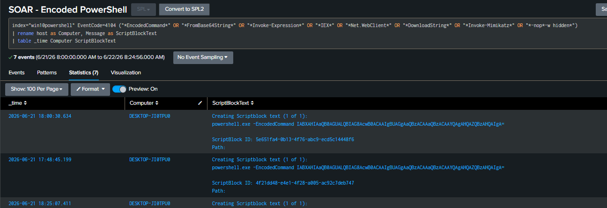

**4****. TRIỂN KHAI ENDPOINT MONITORING – SYSMON (Bước này làm trước bước 4.5)**
**4****.1 Sysmon Là Gì?**
System Monitor là một dịch vụ hệ thống và device driver của bộ công cụ Sysinternals (Microsoft). Sysmon ghi lại chi tiết các hoạt động trên hệ thống vào Windows Event Log, bao gồm:
Tạo/kết thúc tiến trình (Process Create/Terminate)
Kết nối mạng
Thay đổi file
Thay đổi registry (Registry Modification)
Tải DLL (Image Load)
Truy vấn DNS
**4****.2 Cài Đặt Sysmon Trên Windows 10**
powershell
1. Tải Sysmon từ Sysinternals
URL: https://learn.microsoft.com/en-us/sysinternals/downloads/sysmon
2. Tải file cấu hình chuẩn (SwiftOnSecurity config)
URL: https://github.com/SwiftOnSecurity/sysmon-config
3. Cài đặt Sysmon với file cấu hình
sysmon64.exe -accepteula -i sysmonconfig-export.xml
4. Kiểm tra Sysmon đã hoạt động
Get-Service Sysmon64
Status: Running

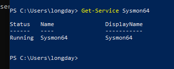

**4****.3 Bật PowerShell ScriptBlock Logging**
Để Alert 3 (Encoded PowerShell) hoạt động, cần bật tính năng ghi nhật ký PowerShell ScriptBlock trên Windows 10:
Tạo registry key cho ScriptBlock Logging
New-Item -Path "HKLM:\SOFTWARE\Policies\Microsoft\Windows\PowerShell\ScriptBlockLogging" -Force
Bật ScriptBlock Logging
Set-ItemProperty -Path "HKLM:\SOFTWARE\Policies\Microsoft\Windows\PowerShell\ScriptBlockLogging" `
-Name "EnableScriptBlockLogging" -Value 1
Khi bật tính năng này, Windows sẽ ghi lại TOÀN BỘ nội dung của mọi PowerShell script được thực thi (kể cả script đã bị mã hóa Base64, sẽ được giải mã rồi ghi lại). Đây là nguồn dữ liệu vô giá trong việc phát hiện mã độc thực thi bằng PowerShell.
**5****. TRIỂN KHAI SOAR - N8N AUTOMATION**
**5****.1 n8n Là Gì?**
n8n là một nền tảng tự động hóa workflow mã nguồn mở, cho phép kết nối các ứng dụng và dịch vụ khác nhau thông qua giao diện kéo-thả trực quan. Trong bối cảnh SOC, n8n đóng vai trò SOAR:
SOAR = Security Orchestration, Automation and Response
- Orchestration : Điều phối nhiều công cụ bảo mật cùng hoạt động
- Automation : Tự động hóa các bước lặp đi lặp lại
- Response : Thực hiện hành động ứng phó (thông báo, block)

**5****.1.1 cấu hình ip tĩnh cho máy ubuntu – n8n**
Chuyển card mạng sang VM net2
**sudo nano /etc/netplan/50-cloud-init.yaml **để đổi lại địa chỉ ipv4 và đổi sang card mạng ens33 thay vì eth0 (NAT)

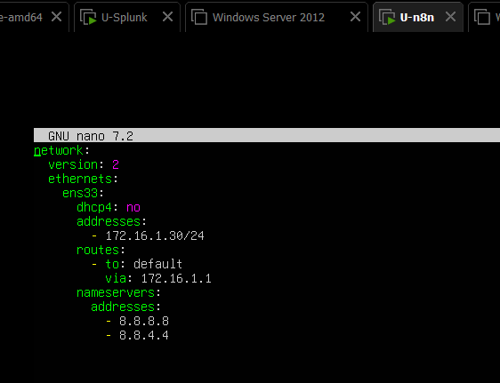

**sudo netplan generate**
**sudo netplan apply**
**ip a** để check xem card đã nhận địa chỉ đã cấu hình

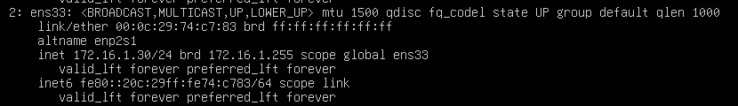

Ping từ firewall pfsense sang n8n đã thông

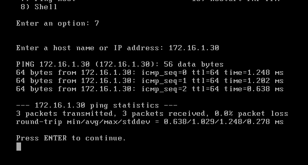

**5****.2 Cài Đặt n8n (Ubuntu Server - 172.16.1.30)**
1. Cài đặt Node.js
curl -fsSL https://deb.nodesource.com/setup_lts.x \| sudo -E bash -
sudo apt-get install -y nodejs
2. Cài đặt n8n
sudo npm install n8n -g
3. Khởi động n8n
n8n start –tunnel
check xem firewall có đang chặn cổng nào không nếu không chặn thì không cần mở như trường hợp mặc định dưới

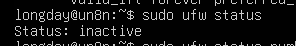

4. Truy cập giao diện Web và tạo workflow như hình là xong
URL:

**6****. CHI TIẾT 3 NHÁNH XỬ LÝ SOAR**
**6****.1 Nhánh 0: Network Threat Detection (Blocked IP)**
Quy Trình

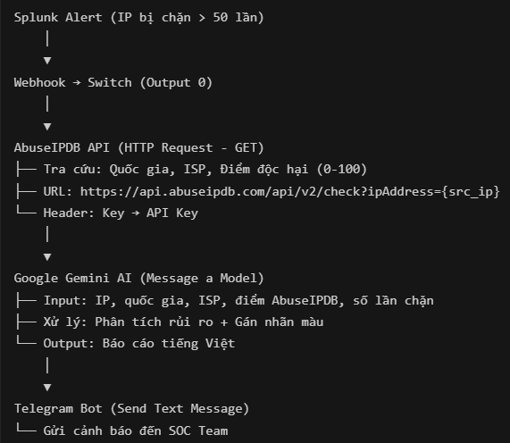

TEST nhánh 0 bằng ip của kali

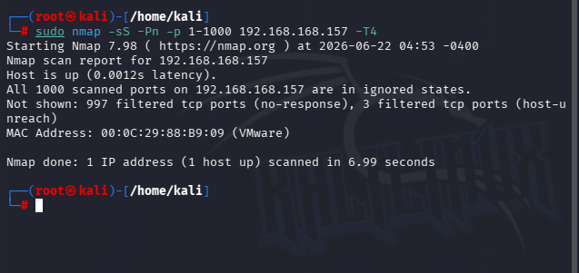

Ngưỡng 50 lần trong 1 phút được chọn vì đây là dấu hiệu điển hình của port scanning hoặc brute force lưu lượng bình thường hiếm khi bị chặn nhiều đến vậy trong thời gian ngắn.
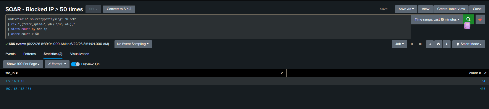
 
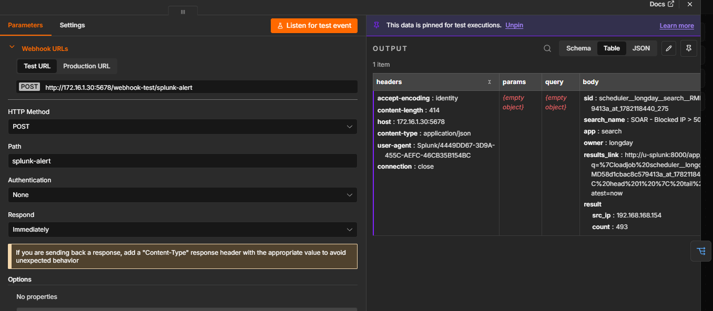

Gemini được prompt để luôn trả về một trong 3 nhãn dựa trên tổng hợp các chỉ số threat intel và ngữ cảnh sự kiện:
| Nhãn | Màu | Điều Kiện | Hành Động Đề Xuất |
| --- | --- | --- | --- |
| ĐỎ | 🔴 | AbuseScore > 80 / VT > 5 engine / PowerShell có C2 rõ ràng | Cách ly máy ngay, điều tra forensic, block IP toàn hệ thống |
| VÀNG | 🟡 | AbuseScore 30–80 / VT 1–5 engine / Hành vi đáng ngờ nhưng chưa xác nhận | Theo dõi chặt, thu thập thêm bằng chứng, kiểm tra endpoint |
| XANH | 🟢 | AbuseScore < 30 / VT = 0 engine / Không có dấu hiệu độc hại rõ ràng | Ghi nhận, tiếp tục giám sát, không cần hành động khẩn cấp |

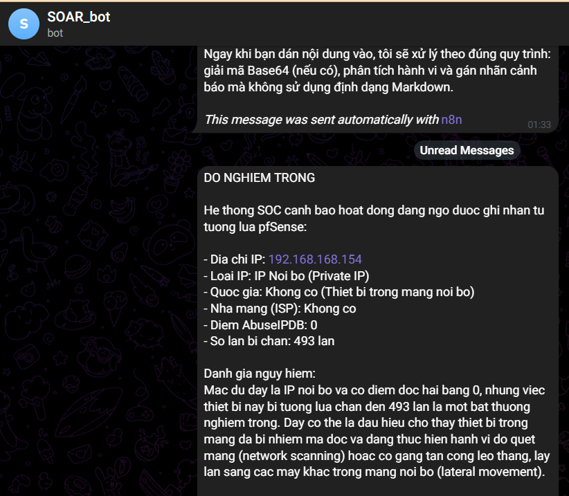

Test bằng IP khác

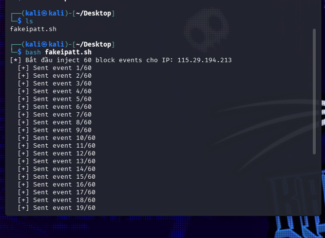

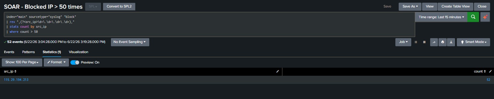

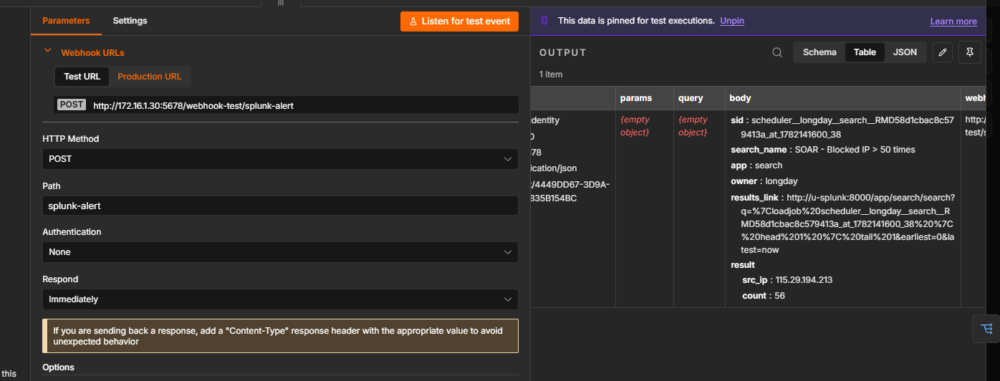

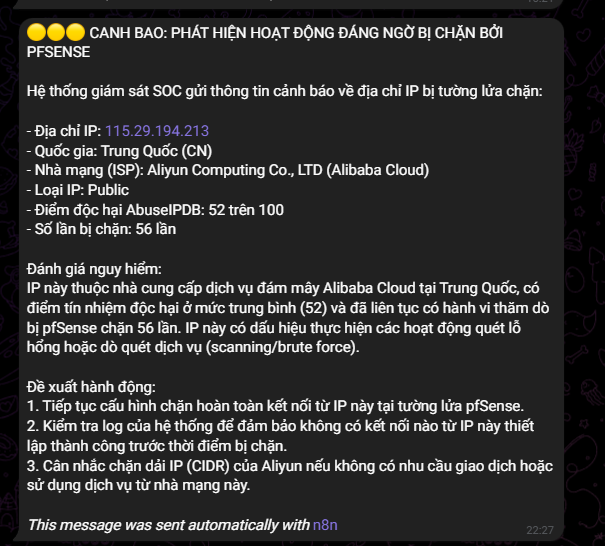

**6****.2 Nhánh 1: Endpoint Threat Detection (Suspicious Sysmon Process)**
Quy Trình

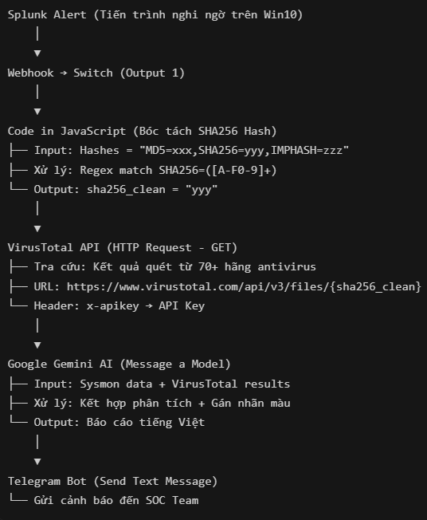

Test chạy certutil.exe download file từ IP 115.29.194.213 trên Windows 10, mô phỏng kỹ thuật LOLBIN Dropper/Downloader (MITRE ATT&CK T1105). Nhưng do tên miền chỉ là bịp nên không thể tải được file nào nhưng vẫn để lại log đẩy lên Splunk.
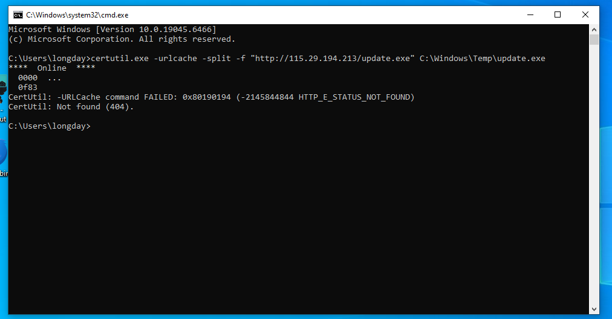

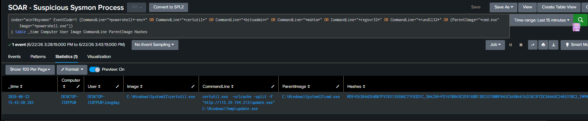
 Điều kiện NOT CommandLine="*-EncodedCommand*" được thêm vào để tránh chồng chéo với Alert 3

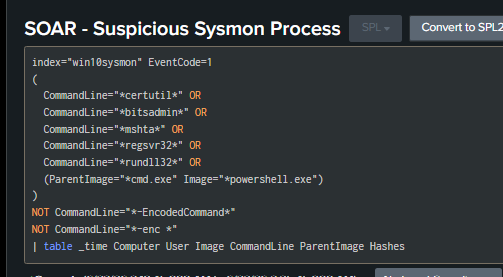

Node Code JavaScript (Bóc Tách Hash)
Splunk gửi trường Hashes dưới dạng chuỗi   nối: MD5=5A430...,SHA256=07859...,IMPHASH=F207....
VirusTotal yêu cầu đúng mã SHA256 thuần. Node Code dùng Regular Expression để bóc tách chính xác phần SHA256 và lưu vào biến sha256_clean.
*let hashes = $input.item.json.body.result.Hashes;*
*let sha256 = "";*
*// Tìm đoạn mã SHA256 bằng Regex*
*let match = hashes.match(/SHA256=([A-F0-9]+)/i);*
*if (match && match[1]) {*
*sha256 = match[1];*
*}*
*// Thêm mã sha256 vào dữ liệu để truyền đi tiếp*
*$input.item.json.sha256_clean = sha256;*
*return $input.item;*

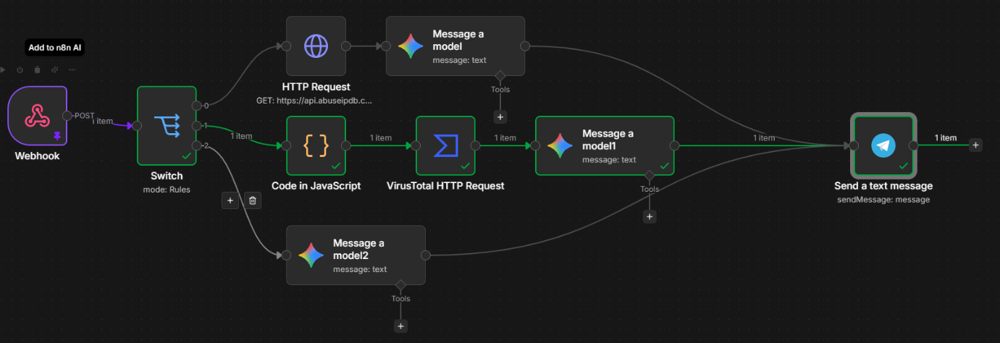

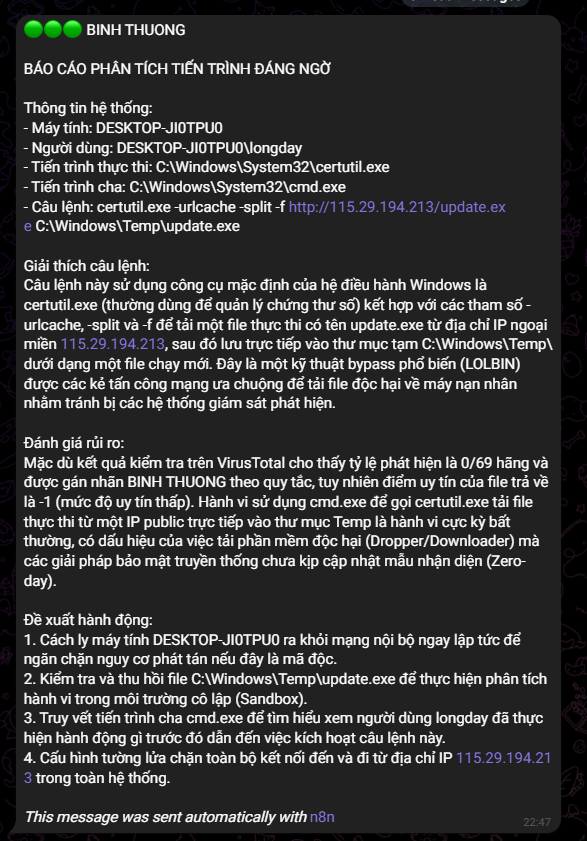

**6****.3 Nhánh 2: PowerShell Threat Detection (Encoded PowerShell)**
Quy Trình

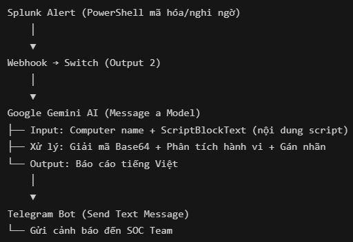

Test

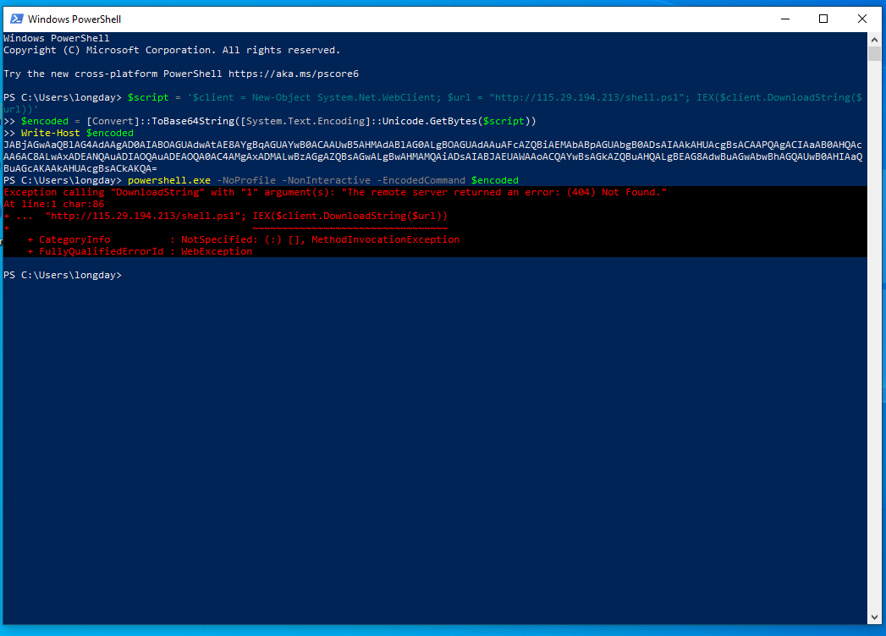

Alert này giám sát index win10powershell, bắt Event ID 4104 chứa các keyword đặc trưng của mã độc PowerShell như EncodedCommand (Base64), IEX/Invoke-Expression, Net.WebClient/DownloadString. Khi phát hiện, Splunk gửi toàn bộ ScriptBlockText sang n8n.
Event ID 4104 là sự kiện đặc biệt quan trọng trong phát hiện tấn công PowerShell: Windows tự động decode nội dung Base64 trước khi ghi vào log, do đó SOC luôn nhìn thấy script thực sự dù attacker có mã hóa bao nhiêu lớp. Đây là lý do ScriptBlockText chứa nội dung đã giải mã sẵn để Gemini phân tích trực tiếp mà không cần bước decode thêm.

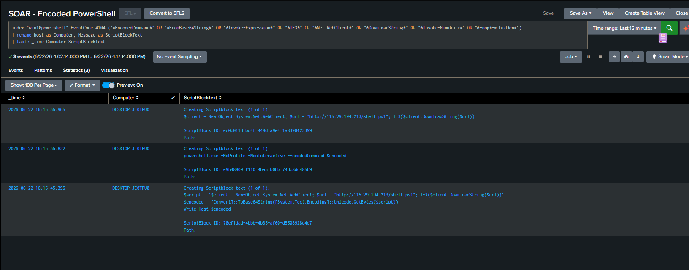
 n8n nhận ScriptBlockText từ Splunk, gửi thẳng cho Gemini không qua VirusTotal vì đây là script text, không phải file có hash. Gemini decode Base64, nhận diện pattern tấn công và gán nhãn nguy hiểm.
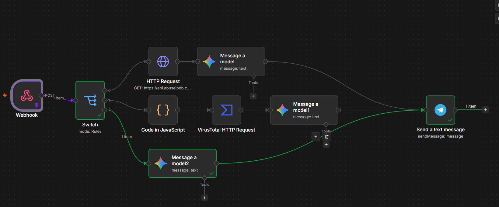

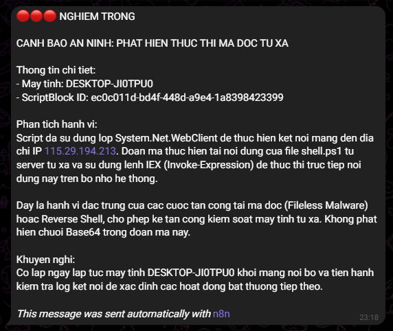

**7****.****KÊT LUẬN**
Dự án SuperSOAR HomeLab đã xây dựng thành công một hệ thống SIEM + SOAR tích hợp AI, giải quyết toàn bộ 5 hạn chế đã xác định từ bài lab pfSense trước đó. Ba use case đại diện cho 3 nhóm mối đe dọa phổ biến nhất trong môi trường SOC thực tế network scanning, LOLBIN execution và PowerShell obfuscation đều được phát hiện và xử lý tự động thành công.

Điểm nổi bật của hệ thống so với giải pháp SIEM truyền thống là việc tích hợp AI (Google Gemini) vào pipeline phân tích. Thay vì SOC Analyst phải đọc log thô và tra cứu thủ công từng IP hay hash, hệ thống tự động tổng hợp dữ liệu từ nhiều nguồn (pfSense, Sysmon, AbuseIPDB, VirusTotal) và cung cấp báo cáo bảo mật có ngữ cảnh sẵn sàng để ra quyết định trong vòng dưới 60 giây. **Nhưng trong thực tế thì cài này là điều**** chưa thể xảy ra vì vấn đề bảo mật thông tin.**

Về mặt học thuật, dự án này cung cấp trải nghiệm thực hành trực tiếp với toàn bộ các thành phần của một SOC hiện đại: SIEM (Splunk), IDS/IPS (Suricata), Endpoint Detection (Sysmon), Threat Intelligence (AbuseIPDB, VirusTotal), SOAR (n8n) và AI-Assisted Analysis (Gemini).
