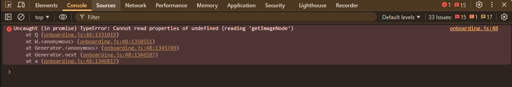
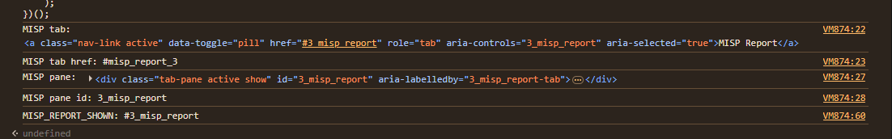
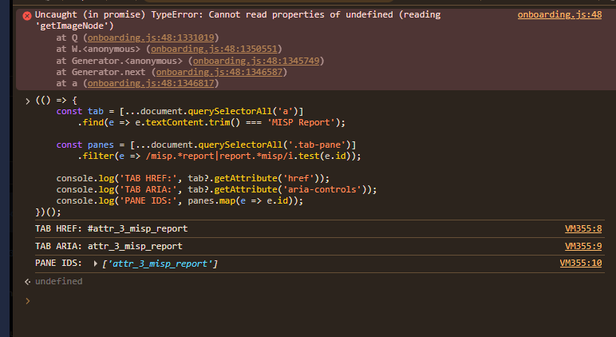

# DFIR-IRIS IrisMISP Report Tab Rendering Bug

## Summary

DFIR-IRIS can successfully execute the IrisMISP enrichment task and store
the returned MISP report, but the **MISP Report** tab may not open in the
IOC modal.


The issue was reproduced on:

- DFIR-IRIS `v2.4.29`
- Docker Compose deployment
- IrisMISP module `v1.3.0`
- MISP enrichment added as an IOC custom attribute
- https://github.com/dfir-iris/iris-web/issues/1078

## Observed behavior

The backend task finishes successfully:

```text
Module name: iris_misp_module
Hook name: on_manual_trigger_ioc
Success: Success
Getting IP report for <IOC>
Adding new attribute MISP IP Report to IOC
Successfully processed hook on_manual_trigger_ioc
```

However, the report tab does not display its content.


Browser DOM inspection shows numeric-first identifiers such as:




```text
TAB HREF: #3_misp_report
TAB ARIA: 3_misp_report
PANE ID: 3_misp_report
```

## Root cause

The generated custom-tab identifier begins with a number.

The affected templates generate tab targets and content-pane IDs in a
numeric-first format:

```text
3_misp_report
```

The hotfix changes the identifier to an alphabetic-first format:


```text
attr_3_misp_report
```

The same identifier is applied consistently to:

- Navigation `href`
- Navigation `aria-controls`
- Content pane `id`
- Content pane `aria-labelledby`

## Files affected

Inside the running DFIR-IRIS application container:

```text
/iriswebapp/app/templates/modals/modal_attributes_nav.html
/iriswebapp/app/templates/modals/modal_attributes_tabs.html
```

## Scope of this repository

This repository provides four small Python utilities:

1. `self_test.py` — tests the patch logic offline.
2. `check.py` — performs a read-only compatibility check.
3. `apply.py` — backs up and patches the two affected templates.
4. `verify.py` — confirms that the patch is present after application.

The scripts do not modify:

- MISP events or attributes
- IRIS cases or IOC values
- API keys or credentials
- IRIS database records
- IrisMISP server configuration
