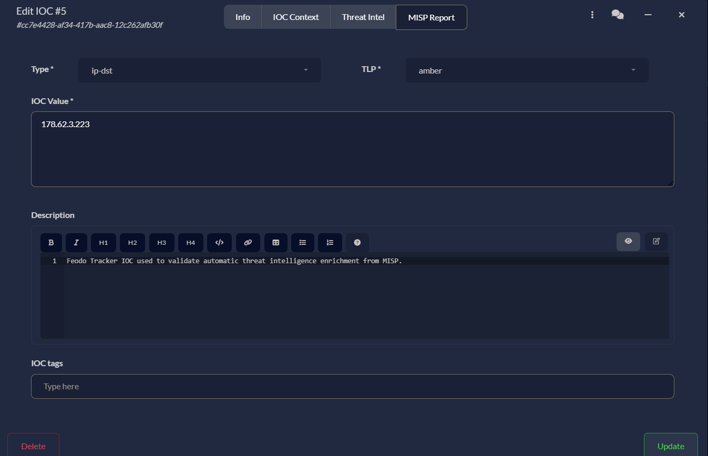
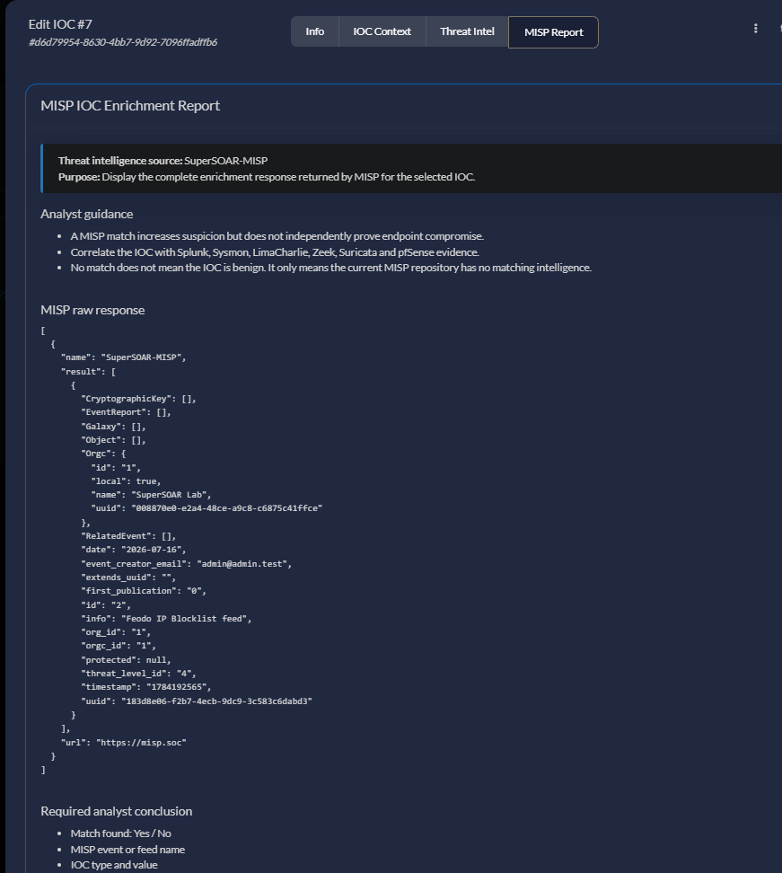

# DFIR-IRIS IrisMISP Custom-Tab Hotfix

This repository contains a focused hotfix for the IrisMISP report-tab
rendering issue reproduced on DFIR-IRIS `v2.4.29`.

BUG Link : https://github.com/dfir-iris/iris-web/issues/1078

## Before



## After


Read [`00_BUG_REPORT.md`](00_BUG_REPORT.md) first for the technical
description, observed symptoms, root cause, affected files, and patch
scope.

## Repository layout

```text
├── 1.self_test.py
├── 2.check.py
├── 3.apply.py
├── 4.verify.py
```

> [!CAUTION]
> A successful hotfix does not require rollback.
>
> Stop after browser validation when the expected result has been
> achieved.

Keep all four Python files in the same directory because `self_test.py`
imports the patch logic from `apply.py`.

---

## Patch workflow

Run the scripts in this order:

```text
Grant permissions
        ↓
Run self_test.py
        ↓
Run check.py
        ↓
Run apply.py --dry-run
        ↓
Run apply.py
        ↓
Run verify.py
        ↓
Validate the MISP Report tab in the browser
```

Do not skip directly to `apply.py`.

---

# 1. Grant execute permission

Run the following commands from the repository directory:

```bash
chmod +x self_test.py
chmod +x check.py
chmod +x apply.py
chmod +x verify.py
```

## Why this step is required

The execute permission allows each Python script to be started directly
with:

```bash
./script_name.py
```

## Check the result

```bash
ls -l self_test.py check.py apply.py verify.py
```

Expected permission flags:

```text
-rwxr-xr-x
```

The file owner, group, timestamp, and file size may be different.

---

# 2. Run the offline self-test

```bash
./self_test.py
```

## Why this command is run

This script validates the regular-expression and replacement logic used
by `apply.py`.

It tests the patch against embedded template samples representing:

- The original DFIR-IRIS v2.4.29-style layout.
- An intermediate numeric-first layout.
- An already-patched layout.

The self-test:

- Does not connect to Docker.
- Does not access the IRIS server.
- Does not modify any file.
- Does not restart any service.

## Expected result

```text
[PASS] Original v2.4.29-style sample
[PASS] Intermediate numeric-first sample
[PASS] Already-patched sample
SELF-TEST PASS
```

> [!IMPORTANT]
> Do not continue if `SELF-TEST PASS` is not displayed.

---

# 3. Check the current IRIS deployment

```bash
./check.py --compose-dir /opt/ir/iris-web
```

## Why this command is run

This script performs a read-only inspection of the two affected
DFIR-IRIS template files inside the running `app` container.

It checks whether the installed templates are:

- Vulnerable to numeric-first custom-tab identifiers.
- Already patched.
- Different from the supported layout.

The script does not:

- Write any file.
- Create a backup.
- Restart the container.
- Modify the IRIS database.

## Expected result before applying the hotfix

```text
Status: VULNERABLE_NUMERIC_FIRST_ID
Next action: run apply.py
```

This means the deployment matches the vulnerable structure and can be
processed by the hotfix.

## Expected result when the deployment is already patched

```text
Status: PATCHED
Next action: run verify.py
```

In this case, do not run `apply.py` again. Continue with `verify.py`.

## Unsupported result

```text
Status: UNSUPPORTED_TEMPLATE_LAYOUT
Next action: stop and inspect the two templates manually.
```

> [!CAUTION]
> Stop immediately if `UNSUPPORTED_TEMPLATE_LAYOUT` is displayed.
>
> Do not force the patch against an unrecognized IRIS version or template
> structure.

### Note about the exit code

When a vulnerable layout is detected, `check.py` may return a non-zero
exit code while still displaying:

```text
Status: VULNERABLE_NUMERIC_FIRST_ID
```

This is intentional. Read the status message before deciding the next
step.

---

# 4. Perform a dry run

```bash
./apply.py \
  --compose-dir /opt/ir/iris-web \
  --dry-run
```

## Why this command is run

The dry run checks whether `apply.py` can identify exactly the four
required template attributes without writing any changes.

The four expected replacements are:

1. Navigation `href`
2. Navigation `aria-controls`
3. Content pane `id`
4. Content pane `aria-labelledby`

## Expected result

```text
Planned replacements:
  href: 1
  aria-controls: 1
  pane id: 1
  pane aria-labelledby: 1

DRY RUN PASS
No files were modified.
```

> [!IMPORTANT]
> Continue only when every replacement count is exactly `1`.

If any replacement count is `0` or greater than `1`, stop and inspect
the installed templates manually.

---

# 5. Apply the hotfix

```bash
./apply.py --compose-dir /opt/ir/iris-web
```

## Why this command is run

This script applies the controlled frontend patch after confirming that
the deployment matches the expected template structure.

The script performs the following actions:

1. Finds the running DFIR-IRIS `app` container.
2. Reads both affected template files.
3. Confirms that the vulnerable structure is present.
4. Calculates both patched files in memory.
5. Confirms exactly four intended replacements.
6. Creates timestamped backups of the original files.
7. Records file size and SHA-256 hashes in `manifest.json`.
8. Writes both patched files into the container.
9. Reads the files again and verifies the result.
10. Restarts only the `app` service.

## Files modified

```text
/iriswebapp/app/templates/modals/modal_attributes_nav.html
/iriswebapp/app/templates/modals/modal_attributes_tabs.html
```

## Default backup location

```text
~/iris-hotfix-backups/iris-misp-report/<UTC_TIMESTAMP>/
```

Example:

```text
~/iris-hotfix-backups/iris-misp-report/20260716T091500Z/
```

## Expected result

```text
Planned replacements:
  href: 1
  aria-controls: 1
  pane id: 1
  pane aria-labelledby: 1

BACKUP PASS: /home/<user>/iris-hotfix-backups/iris-misp-report/<timestamp>
PATCH VERIFICATION PASS
APP SERVICE RESTARTED
HOTFIX APPLIED SUCCESSFULLY
Rollback backup: /home/<user>/iris-hotfix-backups/iris-misp-report/<timestamp>
```

> [!IMPORTANT]
> Save the printed backup directory.
>
> It is required only when the patch must be rolled back.

---

# 6. Verify the applied patch

```bash
./verify.py \
  --compose-dir /opt/ir/iris-web \
  --show-lines
```

## Why this command is run

This script reads the two template files again and confirms that all
four required identifiers use the safe alphabetic-first format.

## Expected result

```text
[PASS] navigation href
[PASS] navigation aria-controls
[PASS] content pane id
[PASS] content pane aria-labelledby
VERIFICATION PASS
Expected rendered pattern: attr_<number>_misp_report
```

The displayed navigation template should contain a structure similar to:

```text
attr_{{page_uid}}{{ loop.index }}_
```

The displayed content-pane template should contain a structure similar
to:

```text
attr_{{page_uid}}{{ outer_loop.index }}_
```

> [!IMPORTANT]
> Do not continue to browser validation unless all four checks display
> `PASS`.

---

# 7. Verify the browser result

After `verify.py` reports success:

1. Close the IOC modal completely.
2. Hard-refresh the browser with:

```text
Ctrl + Shift + R
```

3. Open the DFIR-IRIS case again.
4. Open the affected IOC.
5. Click the **MISP Report** tab.
6. Confirm that the report content is displayed.

## Optional DOM verification

Open browser Developer Tools and run the following code in the Console:

```javascript
(() => {
  const tab = [...document.querySelectorAll("a")].find(
    (element) => element.textContent.trim() === "MISP Report",
  );

  const panes = [...document.querySelectorAll(".tab-pane")].filter((element) =>
    /misp.*report|report.*misp/i.test(element.id),
  );

  console.log("TAB HREF:", tab?.getAttribute("href"));
  console.log("TAB ARIA:", tab?.getAttribute("aria-controls"));
  console.log(
    "PANE IDS:",
    panes.map((element) => element.id),
  );
})();
```

## Expected browser result

```text
TAB HREF: #attr_3_misp_report
TAB ARIA: attr_3_misp_report
PANE IDS: ["attr_3_misp_report"]
```

The number may be different for another IOC custom attribute.

## Successful completion criteria

The hotfix is considered successful when:

- `self_test.py` reports `SELF-TEST PASS`.
- `check.py` recognizes the deployment.
- The `apply.py` dry run finds exactly four replacements.
- `apply.py` reports `HOTFIX APPLIED SUCCESSFULLY`.
- `verify.py` reports four `PASS` results.
- The **MISP Report** tab opens normally.
- The report content is visible without a browser-console workaround.

---

<h1 align="center">🚨 ROLLBACK WARNING — READ BEFORE RUNNING 🚨</h1>

> [!CAUTION]
> **DO NOT RUN THE ROLLBACK COMMANDS WHEN THE HOTFIX WORKS CORRECTLY.**
>
> Rollback is only for users who completed the previous steps but did
> **not** receive the expected result, or whose IRIS interface stopped
> working correctly after the patch.
>
> If the MISP Report tab opens normally and `verify.py` reports
> `VERIFICATION PASS`, stop here. The installation is successful and
> rollback is not required.
>
> Running rollback after a successful installation will intentionally
> remove the hotfix and restore the original vulnerable template files.

# 8. Rollback only after an unsuccessful result

Rollback restores the two original template files created by
`apply.py` before the modification.

## Use rollback only when one of these conditions occurs

- `apply.py` wrote the patch, but the MISP Report tab still does not open.
- `verify.py` reports one or more failed checks.
- The IRIS IOC modal or custom tabs behave incorrectly after the patch.
- The `app` service fails to operate normally after the patch.
- The user explicitly wants to remove the hotfix and restore the
  original files.

## Do not use rollback when

- `verify.py` reports `VERIFICATION PASS`.
- The MISP Report tab opens correctly.
- The MISP report content is visible.
- The IRIS interface works normally.
- The hotfix has already produced the expected result.

> [!WARNING]
> Rollback is not another installation step.
>
> It is an emergency recovery procedure for an unsuccessful or unwanted
> patch result.

## Set the backup directory

Use the exact backup path printed by `apply.py`.

Example:

```bash
BACKUP_DIR="$HOME/iris-hotfix-backups/iris-misp-report/20260716T091500Z"
```

Do not copy the example timestamp blindly. Replace it with the actual
directory created on the server.

## Confirm that the backup files exist

```bash
ls -lh "$BACKUP_DIR"
```

Expected files:

```text
manifest.json
modal_attributes_nav.html.original
modal_attributes_tabs.html.original
```

Do not continue if either `.original` file is missing or empty.

## Find the running application container

```bash
APP_CONTAINER=$(cd /opt/ir/iris-web && docker compose ps -q app)
```

Check the result:

```bash
echo "$APP_CONTAINER"
```

A container ID must be displayed.

## Restore the original navigation template

```bash
docker cp \
  "$BACKUP_DIR/modal_attributes_nav.html.original" \
  "$APP_CONTAINER:/iriswebapp/app/templates/modals/modal_attributes_nav.html"
```

## Restore the original content-pane template

```bash
docker cp \
  "$BACKUP_DIR/modal_attributes_tabs.html.original" \
  "$APP_CONTAINER:/iriswebapp/app/templates/modals/modal_attributes_tabs.html"
```

## Restart the IRIS application service

```bash
cd /opt/ir/iris-web
docker compose restart app
```

## Verify the service status

```bash
docker compose ps app
```

The application service should return to an `Up` or running state.

## Refresh the browser

Close the IOC modal and perform a hard refresh:

```text
Ctrl + Shift + R
```

The two template files are now restored to their state before
`apply.py` was executed.

---

# Important limitation

The patch is applied inside the currently running DFIR-IRIS application
container.

It normally survives a standard container restart:

```bash
docker compose restart app
```

However, it may be lost when:

- The application container is recreated.
- A new Docker image is pulled.
- DFIR-IRIS is upgraded.
- Docker Compose rebuilds the service.

For a permanent upstream solution, the corrected template identifiers
should be included in the official DFIR-IRIS source code and Docker
image.

---

# Safety summary

```text
self_test.py = Offline test only
check.py     = Read-only inspection
apply.py     = Backup, patch, verify, and restart
verify.py    = Read-only post-patch verification
rollback     = Emergency recovery only
```

> [!CAUTION]
> A successful hotfix does not require rollback.
>
> Stop after browser validation when the expected result has been
> achieved.
